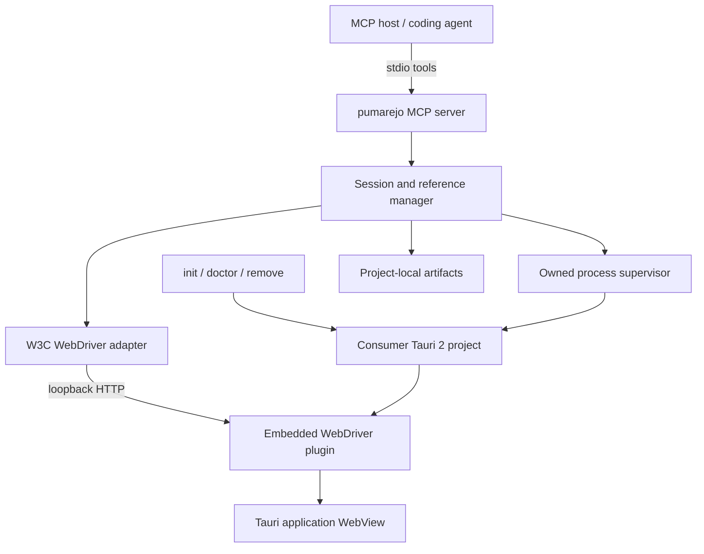
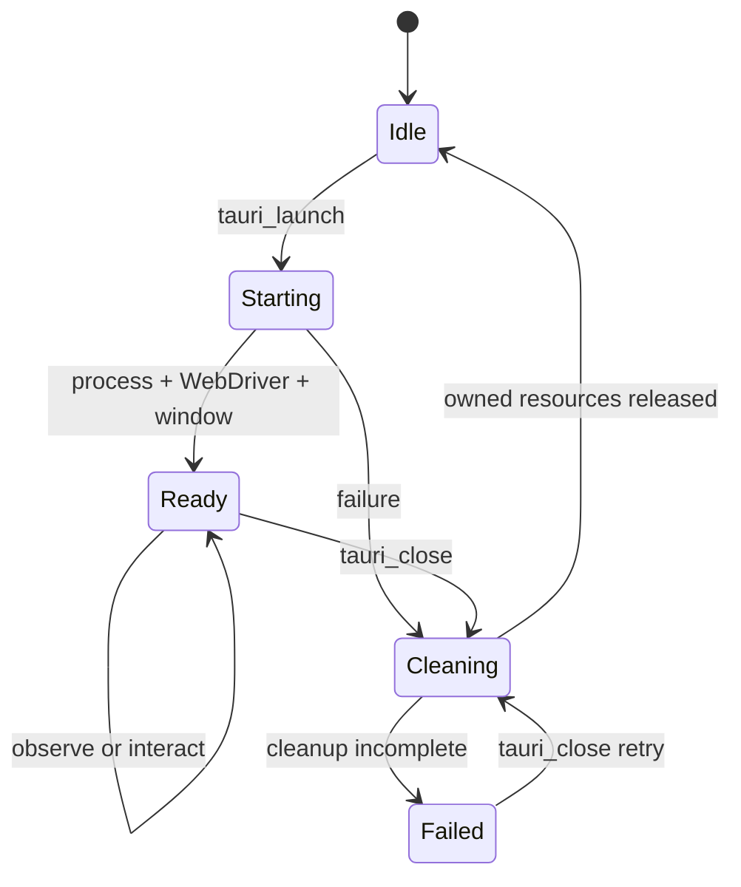

# pumarejo Architecture

## System shape

pumarejo is one ESM TypeScript npm package with one CLI binary.
It acts as a domain adapter between MCP clients and the W3C WebDriver server embedded in a debug Tauri application.



## Runtime boundaries

- **CLI boundary:** parses commands, resolves the project root, renders changes or diagnostics, and starts the MCP stdio transport.
- **Installer boundary:** detects Tauri 2, edits Cargo/config/capability/Rust integration, records attributable changes, and reverses them.
- **MCP boundary:** validates public tool schemas, serializes results, and prevents non-protocol stdout output.
- **Session boundary:** owns exactly one launch state machine, process tree, port, WebDriver session, window selection, snapshot generation, and artifact directory.
- **WebDriver boundary:** hides WebDriver protocol details behind operations needed by the seven public tools.
- **Platform boundary:** supplies visible/background launch preparation for Windows and Ubuntu without changing public MCP behavior.

## Session state machine



Only `Ready` accepts observation and interaction.
Every transition into `Cleaning` uses the same idempotent resource cleanup path.

## Package modules

```text
src/
  cli/
  config/
  installer/
  integration/
  interaction/
  mcp/
  observation/
  platform/
  session/
  shared/
  webdriver/
tests/
  fixtures/
```

This is a planning boundary, not a promise to consumers.

## Technology baseline

- TypeScript with strict checking and ESM output.
- Node.js supported LTS lines; the initial CI matrix targets Node.js 22 and 24.
- pnpm for repository dependency management and scripts.
- Official MCP TypeScript SDK v1 production line with Zod-backed tool schemas.
- A WebDriver adapter over the standard W3C protocol; the selected low-level client remains replaceable.
- Vitest for unit and integration tests.
- A compiled `dist/` executable entry with a Node shebang.

## Consumer integration

The installer uses the official embedded-provider pattern:

- `tauri-plugin-wdio-webdriver = { version = "1", optional = true }` behind a generated `pumarejo = ["dep:tauri-plugin-wdio-webdriver"]` Cargo feature; Cargo does not support `cfg(debug_assertions)` dependency tables.
- plugin registration gated by both debug assertions and the `pumarejo` feature.
- `wdio-webdriver:default` in the selected capability.
- `TAURI_WEBDRIVER_PORT` supplied only to the owned application process.
- a validated executable-plus-arguments launch profile that enables `pumarejo` and contains a `{tauriConfig}` placeholder so each agent launch receives a mode-specific Tauri configuration overlay.

The integration must not require `tauri-plugin-wdio`, `@wdio/tauri-plugin`, `withGlobalTauri`, frontend imports, IPC interception, or log forwarding for v1.

## Background mode feasibility gate

Background mode is product scope but not yet a proven mechanism.
The first technical roadmap item must build a disposable fixture and prove the full observation/interaction sequence:

- On Ubuntu LTS, use an isolated virtual display when a visible display is unavailable.
- On Windows 11, create the primary window hidden from its initial Tauri configuration in background mode while preserving WebDriver rendering and screenshots.
- Verify no operating-system input injection and no controlled window on the active desktop.
- Treat failure on either platform as an architecture blocker that requires a different internal mechanism, not a product-scope reduction.

## Installer safety

- All project changes are planned before the first write.
- Ambiguous Rust source transformations abort before mutation.
- Writes use temporary siblings and atomic replacement where the platform permits.
- An integration manifest under `.pumarejo/` records inserted markers and attributable values for safe removal.
- `remove` refuses to delete content whose recorded value has been changed by the developer and reports the manual action required.

## Security model

- The MCP server is a local stdio child of a trusted MCP host.
- The provider endpoint is private to the owned child and reached through an agent-owned loopback proxy using a per-session nonce; the proxy rejects missing/incorrect credentials, the provider port is never returned to MCP clients, and launch fails closed unless exclusive ownership is proven.
- The process owner records PID, creation/start time, command hash, port, and session nonce and revalidates that lease immediately before termination to prevent PID reuse and port-race cleanup errors.
- MCP tool arguments cannot inject or replace the application command.
- Artifact paths are confined to the project-configured directory.
- Session artifact directories receive owner/current-user-only permissions before the first content write (Linux owner modes; Windows current-user-only DACL). Permission failure is typed and fails closed.
- A durable per-session artifact manifest is written before the first artifact. Normal close deletes non-retained artifacts; the next MCP startup also validates and removes stale non-retained manifest directories without traversing symlinks or junctions outside the configured root.
- Screenshot persistence is bounded to 24 MiB per PNG, 256 MiB and 256 entries per session. PNG validation covers canonical base64, chunk structure and CRCs, legal IHDR values, dimensions and total pixels before image data reaches storage or MCP output.
- Filesystem operations revalidate canonical directories and regular temporary files after creation, after permission enforcement and around rename. The trusted-local-project model excludes a separate malicious process running as the same OS user and continuously replacing owner-controlled directories; portable Node APIs do not expose the directory-handle-relative operations needed to make that stronger adversary atomic on both platforms.
- Rendered UI content is untrusted application data; the MCP adapter preserves a structural boundary between observations and tool instructions and redacts sensitive values.
- Process termination is limited to the owned process tree.
- Release builds must not register the WebDriver plugin.

## Snapshot reference model

The embedded Tauri provider accepts W3C element handles as Execute Script
arguments but serializes DOM nodes in Execute Script results as `null`. The
adapter therefore materializes bounded light-DOM and open-shadow handles first,
passes those exact DOM objects into one observation script, and maps each
descriptor back by object identity. It never reconstructs a target from labels,
selectors, text, or geometry. DOM additions without a materialized handle fail
the capture before the generation table is replaced; removed handles are
ignored because they are absent from traversal. Node assigns generation-scoped
public refs only after the complete result validates.

## Interaction target model

Every referenced action resolves only the exact W3C element handle stored for
the current snapshot generation. Immediately before mutation, a bundled browser
script recomputes the handle's private semantic identity: kind, role,
accessible name, input type and bounded ownership context. A detached handle or
any identity change fails with `STALE_ELEMENT_REF`; visibility, enabled state
and editability then produce their specific typed errors.

Click, clear/type and supported key actions use WebDriver commands exclusively.
The implementation contains no selector, text, geometry or operating-system
input fallback. Actions are serialized, and any attempted mutation invalidates
the reference table before a new snapshot generation is published. Provider or
post-action snapshot failure therefore leaves no actionable old references.

Descriptors are emitted in stable DOM preorder with `parentRef` containment.
Accessible names use the v1 precedence documented in `docs/contracts.md`, and
state fields mirror the applicable HTML/ARIA states. The extractor reads the
document and open shadow roots, enforces a 10,000-element traversal/handle
budget plus a whole-prepass deadline, performs redaction before serialization,
and never installs a registry or marker in application runtime state.

## Sources

- [Tauri WebDriver documentation](https://v2.tauri.app/develop/tests/webdriver/)
- [WebdriverIO Tauri embedded plugin setup](https://webdriver.io/docs/desktop-testing/tauri/plugin-setup/)
- [Official MCP TypeScript SDK](https://github.com/modelcontextprotocol/typescript-sdk)
