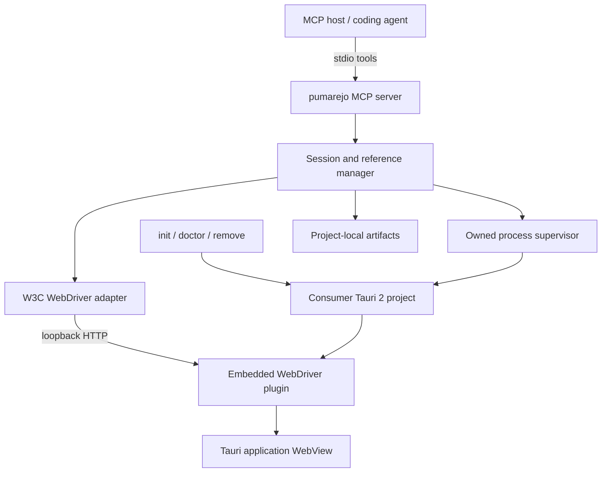
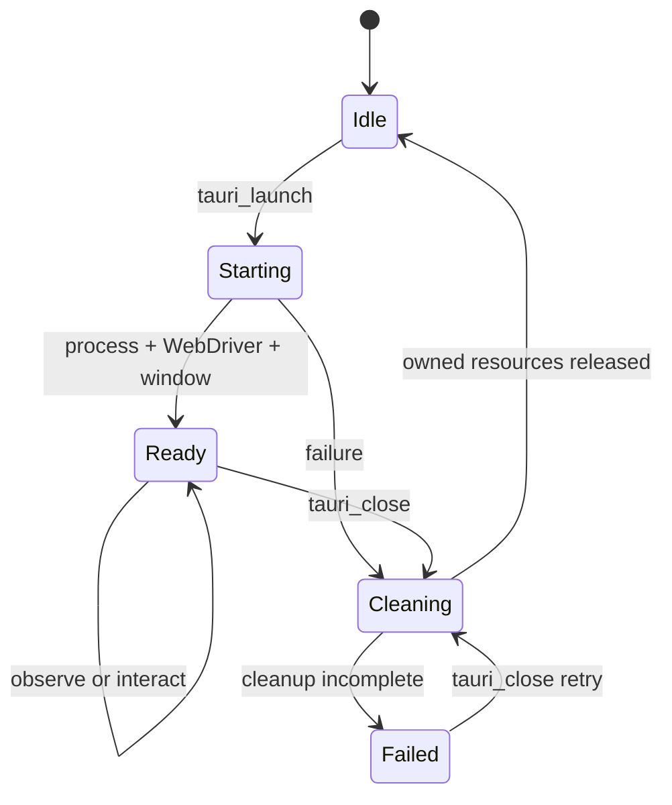

# pumarejo Architecture

## Portable provider delivery

The modified `tauri-plugin-wdio-webdriver` crate is a curated 46-file bundle
under `dist/provider/tauri-plugin-wdio-webdriver`. The build allowlist names
every Cargo, permission, attribution, and Rust source file; it never walks the
vendor tree, so Cargo targets, VCS metadata, caches, lock artifacts, links, and
machine-specific files cannot enter a package.

`init` copies that bundle into the consumer at
`.pumarejo/provider/tauri-plugin-wdio-webdriver` and writes the dependency in
`src-tauri/Cargo.toml` with the project-relative path
`../.pumarejo/provider/tauri-plugin-wdio-webdriver`. The package source is
resolved relative to the installed package's `dist` directory, with the
repository vendor tree used only as a development fallback.

Each staged file is represented by a deterministic `provider` manifest entry
with `beforeHash: null`, its exact bundle-relative attribution, and its final
content hash. The normal atomic write journal stages these entries together
with the consumer edits and rolls back on any partial failure. Provider
directories are removed only after every attributed regular file is verified
unchanged, and only with non-recursive empty-directory removal.

## System shape

pumarejo is one ESM TypeScript npm package with one CLI binary.
It acts as a domain adapter between MCP clients and the W3C WebDriver server embedded in a debug Tauri application.


```mermaid
flowchart TB
  Host["MCP host / coding agent"] -->|stdio tools| Server["pumarejo MCP server"]
  Server --> Session["Session and reference manager"]
  Session --> Driver["W3C WebDriver adapter"]
  Driver -->|loopback HTTP| Plugin["Embedded WebDriver plugin"]
  Plugin --> WebView["Tauri application WebView"]
  CLI["init / doctor / remove"] --> Project["Consumer Tauri 2 project"]
  Project --> Plugin
  Session --> Process["Owned process supervisor"]
  Process --> Project
  Session --> Artifacts["Project-local artifacts"]
```

## Runtime boundaries

- **CLI boundary:** parses commands, resolves the project root, renders changes or diagnostics, and starts the MCP stdio transport.
- **Installer boundary:** detects Tauri 2, edits Cargo/config/capability/Rust integration, records attributable changes, and reverses them.
- **MCP boundary:** validates public tool schemas, serializes results, and prevents non-protocol stdout output.
- **Session boundary:** owns exactly one launch state machine, process tree, port, WebDriver session, bounded surface graph/selection, snapshot generation, and artifact directory.
- **Observability boundary:** receives only owned launch phases, process stream chunks, invocation outcomes, and projected errors; sanitizes them before a finite in-memory ring buffer and exposes a bounded read-only query.
- **WebDriver boundary:** hides WebDriver protocol details behind operations needed by the public observation, surface, and interaction tools; frame switching remains an explicit provider capability.
- **Platform boundary:** supplies visible/background launch preparation for Windows and Ubuntu without changing public MCP behavior. On Windows, the managed launch path uses the embedded Job Object bridge: `CreateProcessW(CREATE_SUSPENDED)`, kill-on-close configuration, assignment, creation-time verification, and only then `ResumeThread`.

The Windows bridge has two deliberately separate lifecycles. Its helper owns the
control stdin/stdout and remains available for bounded inspect/terminate frames
until explicit release, controller EOF, or fatal protocol/native failure. The
target receives an EOF-capable non-control stdin plus dedicated inherited
stdout/stderr pipes. Target bytes are carried back only as bounded, tagged
output frames; they are never eligible to satisfy a control waiter. Termination
waits on the target process handle held by the Job, so helper exit is not used as
evidence that the target exited.

## Session state machine


```mermaid
stateDiagram-v2
  [*] --> Idle
  Idle --> Starting: tauri_launch
  Starting --> Ready: process + WebDriver + window
  Starting --> Cleaning: failure
  Ready --> Ready: observe or interact
  Ready --> Cleaning: tauri_close
  Cleaning --> Idle: owned resources released
  Cleaning --> Failed: cleanup incomplete
  Failed --> Cleaning: tauri_close retry
```

Only `Ready` accepts observation and interaction.
Every transition into `Cleaning` uses the same idempotent resource cleanup path.

## Package modules

```text
src/
  cli/
  config/
  installer/
  integration/
  interaction/
  mcp/
  observation/
    surfaces.ts
  platform/
  session/
  shared/
  webdriver/
tests/
  fixtures/
```

This is a planning boundary, not a promise to consumers.

## Technology baseline

- TypeScript with strict checking and ESM output.
- Node.js supported LTS lines; the initial CI matrix targets Node.js 22 and 24.
- pnpm for repository dependency management and scripts.
- Official MCP TypeScript SDK v1 production line with Zod-backed tool schemas.
- A WebDriver adapter over the standard W3C protocol; the selected low-level client remains replaceable.
- Vitest for unit and integration tests.
- A compiled `dist/` executable entry with a Node shebang.

## Consumer integration

The installer uses the official embedded-provider pattern:

- `tauri-plugin-wdio-webdriver = { version = "1", optional = true }` behind a generated `pumarejo = ["dep:tauri-plugin-wdio-webdriver"]` Cargo feature; Cargo does not support `cfg(debug_assertions)` dependency tables.
- plugin registration gated by both debug assertions and the `pumarejo` feature.
- `wdio-webdriver:default` in the selected capability.
- `TAURI_WEBDRIVER_PORT` supplied only to the owned application process.
- a validated executable-plus-arguments launch profile that enables `pumarejo` and contains a `{tauriConfig}` placeholder so each agent launch receives a mode-specific Tauri configuration overlay.

The integration must not require `tauri-plugin-wdio`, `@wdio/tauri-plugin`, `withGlobalTauri`, frontend imports, IPC interception, or log forwarding for v1.

## Background mode feasibility gate

Background mode is product scope but not yet a proven mechanism.
The first technical roadmap item must build a disposable fixture and prove the full observation/interaction sequence:

- On Ubuntu LTS, use an isolated virtual display when a visible display is unavailable.
- On Windows 11, create the primary window hidden from its initial Tauri configuration in background mode while preserving WebDriver rendering and screenshots.
- Verify no operating-system input injection and no controlled window on the active desktop.
- Treat failure on either platform as an architecture blocker that requires a different internal mechanism, not a product-scope reduction.

## Installer safety

- All project changes are planned before the first write.
- Ambiguous Rust source transformations abort before mutation.
- Writes use temporary siblings and atomic replacement where the platform permits.
- An integration manifest under `.pumarejo/` records inserted markers and attributable values for safe removal.
- `remove` refuses to delete content whose recorded value has been changed by the developer and reports the manual action required.
- `doctor --self` is a separate read-only engine. It inspects a fixed package
  manifest plus bounded metadata-derived dependency/bin targets under one
  verified installation root; it does not recurse through `node_modules`.
- Portable-runtime compatibility enters the self report through an injected
  structured evidence seam. The diagnostic engine performs no process launch
  and makes no host/child equivalence claim without effective child evidence.

## Security model

- The MCP server is a local stdio child of a trusted MCP host.
- The provider endpoint is private to the owned child and reached through an agent-owned loopback proxy using a per-session nonce; the proxy rejects missing/incorrect credentials, the provider port is never returned to MCP clients, and launch fails closed unless exclusive ownership is proven.
- The process owner records PID, creation/start time, command hash, port, and session nonce and revalidates that lease immediately before termination to prevent PID reuse and port-race cleanup errors. Windows custody retains an opaque helper/Job handle and terminates through that handle; a validated-tree/raw-PID path is diagnostic-only and never release-grade.
- MCP tool arguments cannot inject or replace the application command.
- Artifact paths are confined to the project-configured directory.
- Session artifact directories receive owner/current-user-only permissions before the first content write (Linux owner modes; Windows current-user-only DACL). Permission failure is typed and fails closed.
- A durable per-session artifact manifest is written before the first artifact. Normal close deletes non-retained artifacts; the next MCP startup also validates and removes stale non-retained manifest directories without traversing symlinks or junctions outside the configured root.
- Screenshot persistence is bounded to 24 MiB per PNG, 256 MiB and 256 entries per session. PNG validation covers canonical base64, chunk structure and CRCs, legal IHDR values, dimensions and total pixels before image data reaches storage or MCP output.
- Filesystem operations revalidate canonical directories and regular temporary files after creation, after permission enforcement and around rename. The trusted-local-project model excludes a separate malicious process running as the same OS user and continuously replacing owner-controlled directories; portable Node APIs do not expose the directory-handle-relative operations needed to make that stronger adversary atomic on both platforms.
- Rendered UI content is untrusted application data; the MCP adapter preserves a structural boundary between observations and tool instructions and redacts sensitive values.
- Process termination is limited to the owned process tree.
- Release builds must not register the WebDriver plugin.

## Snapshot reference model

The embedded Tauri provider accepts W3C element handles as Execute Script
arguments but serializes DOM nodes in Execute Script results as `null`. The
adapter therefore materializes bounded light-DOM and open-shadow handles first,
passes those exact DOM objects into one observation script, and maps each
descriptor back by object identity. It never reconstructs a target from labels,
selectors, text, or geometry. DOM additions without a materialized handle fail
the capture before the generation table is replaced; removed handles are
ignored because they are absent from traversal. Node assigns generation-scoped
public refs only after the complete result validates.

## Interaction target model

Every referenced action resolves only the exact W3C element handle stored for
the current snapshot generation. Immediately before mutation, a bundled browser
script recomputes the handle's private semantic identity: kind, role,
accessible name, input type and bounded ownership context. A detached handle or
any identity change fails with `STALE_ELEMENT_REF`; visibility, enabled state
and editability then produce their specific typed errors.

Click, clear/type and supported key actions use WebDriver commands exclusively.
The implementation contains no selector, text, geometry or operating-system
input fallback. Actions are serialized and a single outcome reducer decides
generation publication: proven no-change preserves the current table, while a
proven change or uncertain effect reserves exactly one next generation and
invalidates old refs. Provider or post-action snapshot failure therefore leaves
no actionable old references.

Bounded sequences retain the outer session FIFO for their complete lifetime;
their individual actions take the snapshot comparison FIFO without re-entering
the session lock. They stop before any stale-generation step and perform at
most one final comparison/publication snapshot.

Descriptors are emitted in stable DOM preorder with `parentRef` containment.
Accessible names use the v1 precedence documented in `docs/contracts.md`, and
state fields mirror the applicable HTML/ARIA states. The extractor reads the
document and open shadow roots, enforces a 10,000-element traversal/handle
budget plus a whole-prepass deadline, performs redaction before serialization,
and never installs a registry or marker in application runtime state.

Surface discovery is a separate bounded provider probe. It enumerates windows,
open-shadow/panel contexts, and provider-reachable iframe contexts without
exposing raw handles or endpoints. Frame selection is attempted only when the
provider supports exact W3C frame commands; otherwise the context remains
`unavailable` or `unsupported` and non-actionable. Surface selection advances
the snapshot generation and binds refs to the selected owned session.

Runtime observability is session-scoped and non-actionable. Console evidence is
capability-gated and remains explicitly unsupported when no approved provider
boundary exists. Count and byte eviction are deterministic, and optional
retention receives only the sanitized bounded projection through an explicit
sink; no retention or cleanup policy is inferred by the runtime.

## Sources

- [Tauri WebDriver documentation](https://v2.tauri.app/develop/tests/webdriver/)
- [WebdriverIO Tauri embedded plugin setup](https://webdriver.io/docs/desktop-testing/tauri/plugin-setup/)
- [Official MCP TypeScript SDK](https://github.com/modelcontextprotocol/typescript-sdk)
