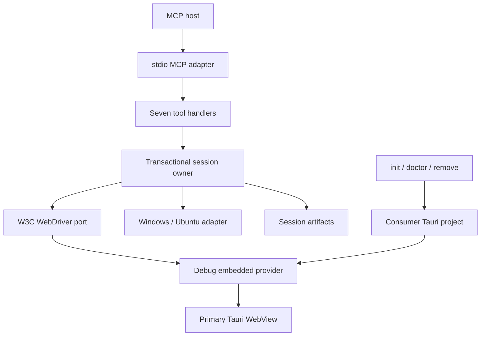
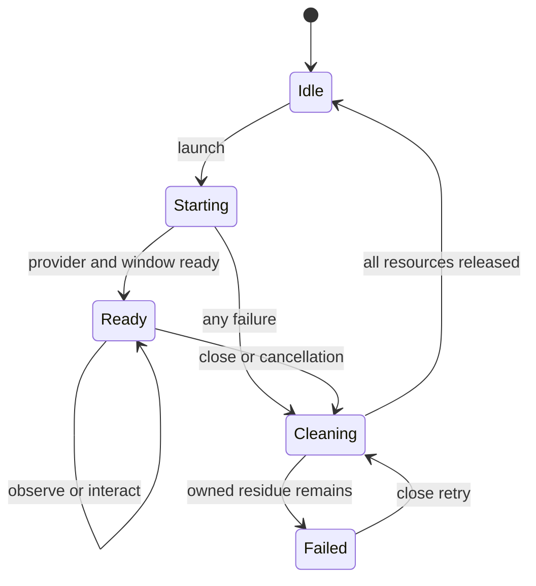
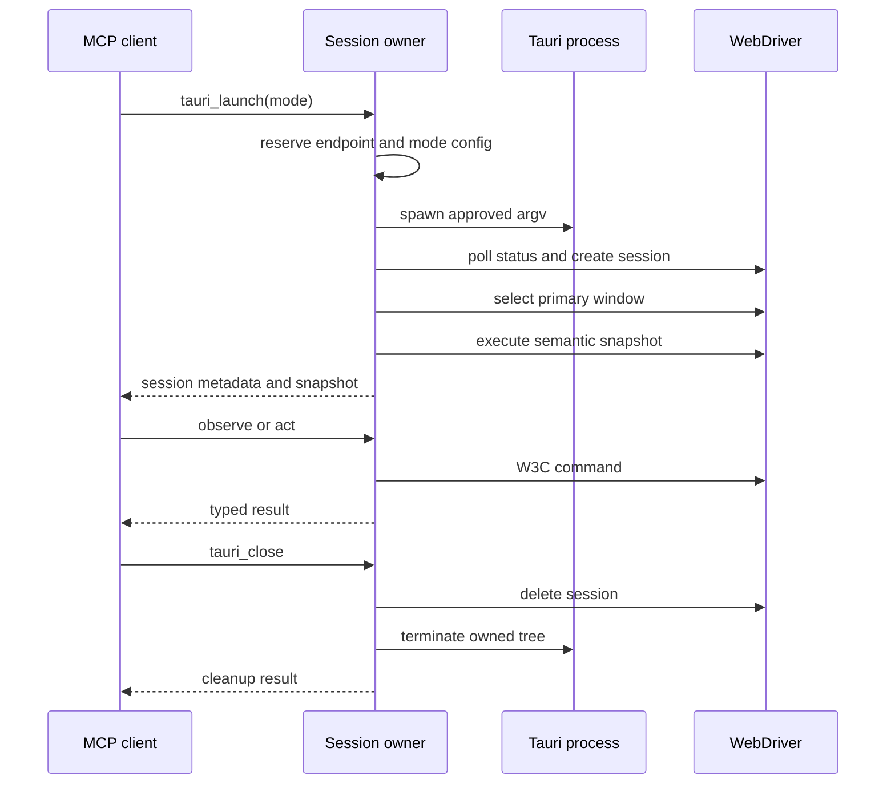

# Tauri Agent - Plan

## Goal Capsule

- **Objective:** Deliver `@cie/tauri-agent` as one reusable npm package that lets MCP agents inspect and operate one instrumented Tauri 2 WebView without taking the developer's operating-system input.
- **Product authority:** `STRATEGY.md`, then `docs/product-requirements.md`, then `docs/contracts.md`; this plan decides implementation mechanics only.
- **Execution profile:** Greenfield, test-first at public contracts, proof-first for platform behavior, serial delivery in roadmap dependency order.
- **Stop conditions:** Stop before dependent implementation if the embedded provider cannot support the required semantic sequence, loopback ownership, or background rendering on either certified platform.
- **Tail ownership:** Implementation and verification stay local until all units pass; repository creation, commits, PRs, registry publication, and release remain the final Release Marshal phase.
- **Product Contract preservation:** Condensed from the validated source without changing scope; source identifiers remain authoritative and are mapped below.

---

## Product Contract

### Summary

Tauri Agent is a thin MCP-to-WebDriver bridge for a single debug Tauri 2 application.
It installs a reversible debug-only integration, launches the app visibly or in the background, exposes meaningful semantic state and screenshots, performs component-level actions, and cleans up every owned resource.

### Problem Frame

Coding agents need the same live interface context a developer sees, but desktop-control tools monopolize the shared pointer, keyboard, and foreground workspace.
A Tauri WebView already exposes a browser-shaped semantic surface through WebDriver, so desktop takeover is unnecessary for supported flows.

### Actors

- A1. **Developer:** owns the consumer project, runs initialization, and keeps using the desktop during an agent session.
- A2. **MCP host:** starts the stdio server and invokes the seven public tools.
- A3. **Coding agent:** interprets typed observations and chooses semantic actions.
- A4. **Consumer application:** a trusted local Tauri 2 project instrumented only for debug builds.

### Requirements

**Package and integration**

- R1. One ESM npm package shall expose the CLI, MCP server, configuration schema, and public tool contracts. Covers FR-001 through FR-008 and NFR-005.
- R2. Initialization shall make only attributable, idempotent, dry-runnable debug integration changes and removal shall preserve unrelated content. Covers FR-001 through FR-007, NFR-003, NFR-008, BR-007, AC-001, AC-008, and AC-009.
- R3. The generated launch profile shall use an executable plus argument vector, include a mode-config placeholder, and never accept command replacement through MCP input. Clarifies the `appCommand` intent in BR-007 without expanding tool scope.
- R4. Diagnostics shall distinguish invalid project/configuration, missing integration, missing platform prerequisites, unavailable ports, and owned process residue. Covers FR-005 and AC-002.

**Session and platform lifecycle**

- R5. One server shall own at most one application process tree, one loopback WebDriver endpoint, one WebDriver session, and one primary window. Covers FR-009 through FR-013 and BR-001 through BR-005.
- R6. Visible and background modes shall expose the same observation and interaction contract on Windows 11 and Ubuntu 24.04 without generating operating-system input. Covers FR-010, FR-024 through FR-027, NFR-001, NFR-002, AC-003 through AC-005.
- R7. Background launch shall use a generated Tauri configuration overlay that creates the primary window hidden from its first presentation; the proof gate must reject any transient appearance, focus theft, or rendering loss.
- R8. Launch and close shall be transactional and idempotent: every failed start or close attempt shall release all resources it owns or report the remaining owned resource precisely. Covers FR-012, FR-013, NFR-006, and AC-007.

**Observation**

- R9. Snapshots shall return meaningful visible controls and content in deterministic DOM preorder with containment, accessible names, explicit interactive states, relationships, focus, bounds, timestamp, and a generation-scoped reference table. Covers FR-014 through FR-016, FR-018, BR-002, BR-010, AC-006, and AC-006a.
- R10. Snapshot extraction shall cover the v1 compatibility profile, including open shadow roots, while excluding closed or cross-origin surfaces with typed limitations. Covers FR-016 and AC-013.
- R11. Password and `data-tauri-agent-sensitive="true"` values and value-bearing text shall be redacted before results cross the MCP boundary. Covers FR-016a, NFR-010, and AC-006b.
- R12. Screenshots shall return MCP image content plus typed metadata, use fail-closed current-user-only project-local artifacts, recover stale non-retained artifacts safely, and delete them on close unless retention is enabled. Covers FR-017, NFR-009, BR-006, AC-012.
- R13. Rendered UI content shall remain untrusted data in typed result fields and shall never be interpolated into tool descriptions, server instructions, errors, or recovery guidance. Covers NFR-010.

**Interaction and agent contract**

- R14. Click, clear/type, and supported key presses shall target snapshot references or the active DOM element through WebDriver only, preserving native WebView focus behavior. Covers FR-019 through FR-021.
- R15. Stale, missing, hidden, disabled, incompatible, and unsupported targets shall return the common typed error envelope with stable recovery guidance and no desktop-automation fallback. Covers FR-022 and FR-023.
- R16. MCP stdio shall expose exactly seven v1 tools with validated schemas, protocol-clean stdout, structured errors, image content, and deterministic cancellation/close behavior. Covers FR-008 through FR-023 and AC-010.

**Certification**

- R17. The fixture matrix shall exercise every included compatibility surface, all lifecycle failures, release-build exclusion, no-OS-input evidence, and both platform modes. Covers NFR-007 and AC-001a through AC-013.
- R18. An MCP-capable agent shall use fixture observations to describe documented flows and propose a compatible new flow against the fixture-owned rubric. Covers AC-006a and AC-011.

### Key Decisions

- **One npm package, not a Rust crate.** Governs R1 and R2. (session-settled: user-directed — chosen over a project-local copied tool or a new Rust distribution: the integration must be independently reusable.)
- **Semantic WebDriver actions, never system input.** Governs R6, R14, and R15. (session-settled: user-directed — chosen over whole-PC control: desktop takeover blocks parallel work.)
- **Visible and background parity in v1.** Governs R6 and R7. (session-settled: user-directed — chosen over visible-only v1: both modes are required.)
- **Agent reasoning stays outside the package.** Governs R9, R13, R16, and R18. (session-settled: user-directed — chosen over an autonomous explorer: the package is a thin context and interaction bridge.)
- **Windows 11 and Ubuntu LTS certification.** Governs R6 and R17. (session-settled: user-directed — chosen over single-platform certification: both target environments are required.)

### Key Flows

- F1. **Instrument a project**
  - **Actors:** A1, A4
  - **Steps:** Detect project; preview or apply attributable changes; write the launch profile and manifest; report MCP configuration.
  - **Outcome:** The project is ready for debug-only agent control and can be restored safely.
  - **Covered by:** R1 through R4.
- F2. **Explore without desktop takeover**
  - **Actors:** A1, A2, A3, A4
  - **Steps:** Start MCP; launch one mode; observe; interact by reference; observe again; close.
  - **Outcome:** The agent sees and operates the WebView while the developer retains the desktop.
  - **Covered by:** R5 through R16.
- F3. **Recover from changing UI**
  - **Actors:** A2, A3, A4
  - **Steps:** Use a snapshot reference; allow the application to replace it; receive a stale-reference error; snapshot again; retry with a current reference.
  - **Outcome:** Dynamic UI changes cannot silently target the wrong component.
  - **Covered by:** R9, R14, R15.
- F4. **Certify agent understanding**
  - **Actors:** A2, A3, A4
  - **Steps:** Explore fixture flows without source access; summarize states and transitions; propose a new compatible flow; score both against the fixture rubric.
  - **Outcome:** Certification measures contextual understanding, not only protocol transport.
  - **Covered by:** R17, R18.

### Acceptance Examples

- AE1. **Covers R2.** Given a supported fixture, when `init` runs twice and `remove` runs once, then integration is not duplicated and the fixture returns to its pre-init semantic state while unrelated edits remain.
- AE2. **Covers R5 through R8.** Given either certified platform and either mode, when launch, snapshot, screenshot, click, type, key press, and close run, then the sequence completes with no OS input and no owned residue.
- AE3. **Covers R7.** Given background mode, when the process starts, then no controlled window appears or activates on the active desktop and WebDriver rendering remains observable.
- AE4. **Covers R9 through R11.** Given a fixture with headings, labels, status, validation, tables, focus, password, and marked-sensitive inputs, when a snapshot is taken, then semantics and relationships are present while protected values are absent.
- AE5. **Covers R12.** Given default retention, when screenshots are saved and the session closes, then their files disappear; given retention enabled, they remain under the configured project directory.
- AE6. **Covers R13.** Given UI text that attempts to instruct the agent or server, when a snapshot or error is returned, then that text remains an untrusted data value and does not alter tool guidance.
- AE7. **Covers R14 and R15.** Given a replaced, hidden, disabled, or incompatible target, when an action is attempted, then the intended typed error and recovery suggestion return without fallback input.
- AE8. **Covers R16.** Given an independent MCP client, when it connects over stdio, then it enumerates seven schema-valid tools and completes F2 without private APIs.
- AE9. **Covers R17 and R18.** Given the certified fixture suite, when a coding agent explores without source access, then its existing-flow summary and proposed flow satisfy the state, transition, validation, and outcome rubric.

### Scope Boundaries

- One primary top-level WebView, one active session, and one package.
- No multiple-window orchestration, native Tauri API calls, frontend instrumentation, IPC mocking, log capture, test recording, assertions, general QA orchestration, or autonomous exploration.
- No closed shadow-root, cross-origin iframe, canvas-only, native menu, tray, picker, permission-dialog, or system-dialog semantic control.
- No operating-system pointer or keyboard injection under any fallback path.
- macOS and non-Ubuntu Linux certification remain deferred.

### Sources

- `STRATEGY.md`
- `docs/product-requirements.md`
- `docs/contracts.md`
- `docs/architecture.md`
- `docs/roadmaps/2026-07-23-001-tauri-agent-roadmap.md`
- [Tauri WebDriver guide](https://v2.tauri.app/develop/tests/webdriver/)
- [WebdriverIO embedded Tauri plugin setup](https://webdriver.io/docs/desktop-testing/tauri/plugin-setup/)
- [MCP TypeScript SDK v1](https://github.com/modelcontextprotocol/typescript-sdk/tree/v1.x)

---

## Planning Contract

### Key Technical Decisions

- KTD1. **Direct W3C client over the embedded provider.** Use `webdriver` 9.x as the replaceable low-level client and do not require `@wdio/tauri-service` or `tauri-plugin-wdio`; the official provider documents that basic WebDriver operations work with `tauri-plugin-wdio-webdriver` alone. Governs R5, R9 through R16.
- KTD2. **MCP SDK v1 production line.** Use `@modelcontextprotocol/sdk` 1.x with Zod 4 because the official v2 SDK is still pre-release in July 2026. Governs R1 and R16.
- KTD3. **Argument-vector launch profiles.** Replace shell-shaped `appCommand` execution with a validated command plus arguments containing one `{tauriConfig}` placeholder; `init` derives the common pnpm, npm, yarn, bun, deno, or cargo form and rejects ambiguity. Governs R3, R5, and R7.
- KTD4. **Mode-specific Tauri configuration overlay.** Generate an ephemeral config merged by `tauri dev --config`; visible mode sets the primary window visible and background mode sets it hidden from creation. The same technique is used on both platforms before introducing any platform-only mechanism. Governs R6 and R7.
- KTD5. **Proof before promotion on release-shaped hosts.** Keep the initial Tauri fixture and platform probes under `tests/fixtures/tauri-app` and `tests/platform/`; promote provider/session behavior into `src/` only after the full load-bearing sequence passes on the candidate Windows image and a native or dedicated-VM Ubuntu 24.04 image. WSLg/Xvfb remains additional development evidence, never the release authority. Governs R6, R7, and R17.
- KTD6. **One transactional session owner.** A state machine owns child process, private provider endpoint, nonce-authenticated loopback proxy, WebDriver session, window selection, snapshot generation, and artifact directory, with one idempotent cleanup stack. The owner lease records PID, creation/start time, command hash, port, and session nonce and revalidates before termination. Governs R5 and R8.
- KTD7. **Standards-derived DOM extraction in one injected, versioned script.** Bundle a standards-derived accessible-name/role implementation such as `dom-accessibility-api` into the read-only browser script, return serializable descriptors plus their DOM elements, traverse open shadow roots, and assign refs in Node after validation without installing an application-side registry. The implementation must pass a checked-in WAI-ARIA/HTML conformance corpus as well as product fixtures. Governs R9 through R13.
- KTD8. **References identify WebDriver handles, generation, and semantic identity.** Store the opaque WebDriver element handle returned with each descriptor, its generation, and a snapshot-time fingerprint of semantic kind, role, accessible name, input type, and stable ownership context; never expose raw element IDs or re-query by label, selector, text, or position. Revalidate the fingerprint immediately before action so virtualized node reuse cannot silently change the target. Governs R9, R14, and R15.
- KTD9. **Content taint stays structural.** UI-derived strings are represented only in result payload fields carrying the untrusted-content contract; static server-authored messages never concatenate them. Governs R11, R13, and R16.
- KTD10. **Project edits are parser-led and marker-backed.** Use TOML/JSON parsers where lossless behavior is safe, narrow textual insertion with explicit markers for Rust, precompute the whole mutation set, and record hashes in an integration manifest. Governs R2 and R4.
- KTD11. **Adapters isolate platform process behavior.** Shared lifecycle logic depends on a small platform adapter for process trees, display preparation, artifact permissions, and environment diagnostics. Governs R5 through R8.
- KTD12. **Protocol skeleton lands early.** Register all seven MCP schemas against stubbed domain ports after the package foundation, then replace stubs as capabilities land. Governs R1 and R16.

### High-Level Technical Design







### Output Structure

```text
package.json
pnpm-lock.yaml
tsconfig.json
tsconfig.build.json
eslint.config.js
vitest.config.ts
src/
  cli/
  config/
  installer/
  mcp/
    tools/
  session/
  webdriver/
  platform/
  observation/
  interaction/
  artifacts/
  shared/
templates/
tests/
  unit/
  integration/
  contract/
  platform/
  fixtures/
    tauri-app/
```

### Assumptions

- The embedded provider implements the W3C status, session, window, script, element, screenshot, and action commands used by the selected low-level client; U1 must verify this before dependent code lands.
- Tauri CLI configuration merging can override the configured primary window's initial `visible` value without changing consumer source; U1 must verify exact merge behavior.
- The local Ubuntu 24.04 WSLg/Xvfb environment is additional development evidence only; U1 requires a native or dedicated-VM Ubuntu 24.04 candidate before implementation promotion.
- Windows build 26200 is valid for development evidence; the release matrix records the final supported Windows 11 image rather than treating this workstation as the only authority.
- If hidden WebViews do not render under either provider, implementation stops at U1 and returns evidence to the product authority rather than silently substituting minimized, off-screen, or focus-stealing behavior.

### Sequencing

U1 is the hard feasibility gate.
U2 and U3 establish the public package surface, after which consumer integration and runtime lifecycle can proceed.
Observation depends on a live session, interaction depends on observation refs, MCP composition depends on all domain ports, and certification closes the graph.

---

## Implementation Units

| Unit | Title | Primary files | Depends on |
|---|---|---|---|
| U1 | Platform and provider proof | package/test harness, `tests/fixtures/tauri-app/`, `tests/platform/` | None |
| U2 | Publishable contracts | `src/config/`, `src/shared/` | U1 |
| U3 | Early MCP protocol skeleton | `src/mcp/`, `tests/contract/` | U2 |
| U4 | Consumer project model | `src/installer/project.ts`, `src/config/` | U2 |
| U5 | Safe init integration | `src/installer/`, `templates/` | U4 |
| U6 | Doctor and removal | `src/cli/`, `src/installer/` | U5 |
| U7 | WebDriver adapter | `src/webdriver/` | U1, U2 |
| U8 | Session and process lifecycle | `src/session/`, `src/platform/` | U2, U7 |
| U9 | Visible and background adapters | `src/platform/`, `src/session/` | U1, U8 |
| U10 | Semantic snapshot engine | `src/observation/` | U7, U8 |
| U11 | Screenshot and artifact lifecycle | `src/artifacts/`, `src/observation/` | U8, U9 |
| U12 | Semantic interactions | `src/interaction/` | U10 |
| U13 | Complete MCP composition | `src/mcp/` | U3, U8, U10, U11, U12 |
| U14 | Cross-platform certification and docs | `tests/`, `README.md` | U5 through U13 |

### U1. Prove embedded provider and platform modes

- **Goal:** Falsify or confirm the load-bearing provider, initial-visibility, rendering, focus, input-isolation, ownership, and cleanup assumptions on the candidate Windows image and a native or dedicated-VM Ubuntu 24.04 image before reusable implementation.
- **Requirements:** R5 through R8, R17; AE2 and AE3.
- **Dependencies:** None.
- **Files:** `package.json`, `pnpm-lock.yaml`, `tsconfig.json`, `tsconfig.build.json`, `eslint.config.js`, `vitest.config.ts`, `tests/fixtures/tauri-app/package.json`, `tests/fixtures/tauri-app/src/index.html`, `tests/fixtures/tauri-app/src-tauri/Cargo.toml`, `tests/fixtures/tauri-app/src-tauri/src/lib.rs`, `tests/fixtures/tauri-app/src-tauri/tauri.conf.json`, `tests/platform/provider-proof.test.ts`, `tests/platform/background-proof.test.ts`, `docs/evidence/rdm-001/README.md`.
- **Approach:** Establish the minimal Node 22/24-compatible package and test harness needed to run the proof. Build the smallest accessible fixture, enable `tauri-plugin-wdio-webdriver` through an optional `tauri-agent` Cargo feature, guard registration with `all(debug_assertions, feature = "tauri-agent")`, connect through the low-level W3C client, and test a generated config overlay for both initial visibility values. Record OS build, display/session type, WebView runtime, provider version, screenshots, focus observations, endpoint binding, and cleanup. Normal release commands omit the feature.
- **Execution note:** Treat this as an evidence-producing spike. Keep only fixture code and automated proof that remain useful to certification.
- **Patterns to follow:** Official embedded-provider debug registration and `TAURI_WEBDRIVER_PORT` setup in the Tauri and WebdriverIO sources.
- **Test scenarios:**
  - On Windows visible mode, perform status, session, window, script, screenshot, click, type, key, and delete-session commands.
  - On native or dedicated-VM Ubuntu 24.04, perform the visible sequence and prove Xvfb background mode has no active-desktop window while screenshots and actions continue.
  - Repeat on Ubuntu WSLg/Xvfb only as non-authoritative development evidence and record its environment limitations.
  - On Windows background mode, prove no initial or transient window presentation, no focus change, and continued screenshot/action behavior.
  - Bind or connect outside loopback and prove the launch gate rejects the endpoint.
  - Race a separate process before ownership and attempt status, new-session, action, and delete-session requests after ownership; verify the private provider port is unreachable without the per-session nonce and prove that no competing client can control or disrupt the owned session, or fail the gate.
  - After each proof scenario, terminate the spike process, delete its session, and release its endpoint; exhaustive phase-by-phase cleanup belongs to U8.
- **Verification:** `docs/evidence/rdm-001/README.md` contains reproducible pass/fail evidence for every scenario and no dependent unit begins on an unresolved failure.

### U2. Establish package foundation and shared contracts

- **Goal:** Turn the U1 harness into the publishable strict ESM package with executable CLI, schemas, configuration loader, and typed error model.
- **Requirements:** R1, R3, R16.
- **Dependencies:** U1.
- **Files:** `src/index.ts`, `src/cli/index.ts`, `src/config/schema.ts`, `src/config/load.ts`, `src/shared/errors.ts`, `src/shared/result.ts`, `tests/unit/config.test.ts`, `tests/contract/exports.test.ts`.
- **Approach:** Pin Node 22/24-compatible dependencies, publish one binary, validate configuration before any side effect, model stable error codes as a discriminated union, and keep stdout reserved for MCP only when serving.
- **Test scenarios:**
  - Load a valid v1 launch profile and normalize project-relative paths.
  - Reject unknown fields, missing placeholder, invalid ports, escaping artifact paths, and shell-shaped MCP overrides.
  - Serialize every stable error without internal stack or secret leakage.
  - Build, import, execute `--help`, execute `--version`, and inspect the packed tarball.
- **Verification:** Build, typecheck, lint, unit tests, contract tests, and package dry-run succeed on Node 22 and 24.

### U3. Land the MCP protocol skeleton

- **Goal:** Register all seven public tools over stdio early with final schemas and stubbed domain ports.
- **Requirements:** R1, R16; AE8.
- **Dependencies:** U2.
- **Files:** `src/mcp/server.ts`, `src/mcp/schemas.ts`, `src/mcp/domain-ports.ts`, `src/mcp/tools/index.ts`, `tests/contract/mcp-server.test.ts`.
- **Approach:** Use MCP SDK v1, validate every input with Zod 4, route through injected domain ports, emit structured tool errors, and send logs only to stderr.
- **Test scenarios:**
  - Enumerate exactly seven tools and compare names and schemas with `docs/contracts.md`.
  - Send valid and invalid input to every tool and verify protocol-shaped results.
  - Inject UI-looking instruction text through a stub and verify it remains result data.
  - Verify no non-protocol bytes reach stdout.
- **Verification:** An independent MCP client connects, lists tools, invokes all stub handlers, observes image-content framing, and closes cleanly.

### U4. Model consumer projects and launch profiles

- **Goal:** Detect supported Tauri 2 projects and derive an unambiguous command-plus-arguments launch profile for their package manager or Cargo CLI.
- **Requirements:** R2 through R4.
- **Dependencies:** U2.
- **Files:** `src/installer/project.ts`, `src/installer/package-manager.ts`, `src/config/generate.ts`, `tests/unit/project-detection.test.ts`, `tests/fixtures/projects/`.
- **Approach:** Inspect Tauri config formats, Cargo metadata, package scripts, lockfiles, and local CLI availability without mutation. Produce a planned integration object or one actionable ambiguity error.
- **Test scenarios:**
  - Detect pnpm, npm, yarn, bun, deno, and cargo Tauri launch shapes.
  - Reject Tauri 1, missing configuration, multiple unresolved configurations, and an ambiguous script.
  - Produce a launch argv containing exactly one mode-config placeholder.
  - Resolve JSON, JSON5, and TOML Tauri configuration where supported.
- **Verification:** Fixture coverage demonstrates deterministic detection and no writes on all rejection paths.

### U5. Apply idempotent debug-only integration

- **Goal:** Implement `init` and dry-run for the optional Cargo feature, debug-and-feature-gated Rust registration, capability permission, launch profile, artifact ignore, and attributable integration manifest.
- **Requirements:** R2, R3; AE1.
- **Dependencies:** U4.
- **Files:** `src/cli/init.ts`, `src/installer/plan.ts`, `src/installer/cargo.ts`, `src/installer/rust.ts`, `src/installer/capabilities.ts`, `src/installer/manifest.ts`, `src/installer/write.ts`, `templates/integration/`, `tests/integration/init.test.ts`.
- **Approach:** Compute every edit before the first write, use parser-backed changes where stable, use narrow marked Rust insertion, write atomic sibling replacements, and record before/after hashes and inserted values.
- **Test scenarios:**
  - Preview each planned edit without changing the fixture.
  - Initialize each supported fixture twice without duplicate content.
  - Abort an ambiguous Rust layout before any partial edit.
  - Preserve existing dependency features, capability entries, formatting-sensitive unrelated values, and package scripts.
  - Verify Cargo uses an optional `tauri-agent = ["dep:tauri-plugin-wdio-webdriver"]` feature rather than a `cfg(debug_assertions)` dependency table, which Cargo does not support.
  - Verify the generated agent dev argv enables `tauri-agent`, the Rust registration requires both debug assertions and that feature, and normal release commands omit it.
- **Verification:** Semantic fixture diffs match the integration plan; an agent-enabled debug build registers the provider, while normal debug/release builds omit the optional dependency and registration.

### U6. Diagnose and remove integration safely

- **Goal:** Implement structured `doctor`, JSON output, residue diagnostics, and conservative `remove`.
- **Requirements:** R2, R4; AE1.
- **Dependencies:** U5.
- **Files:** `src/cli/doctor.ts`, `src/cli/remove.ts`, `src/installer/doctor.ts`, `src/installer/remove.ts`, `tests/integration/doctor.test.ts`, `tests/integration/remove.test.ts`.
- **Approach:** Run independent diagnostics with stable identifiers, distinguish ready/warn/error, compare the integration manifest before removal, and refuse destructive reversal after developer modification.
- **Test scenarios:**
  - Report every missing prerequisite listed by FR-005 independently.
  - Emit matching human and JSON diagnostic identities.
  - Remove unchanged attributable edits and preserve unrelated edits.
  - Refuse to remove a recorded value changed by the developer and provide a manual action.
  - Detect stale owned residue without terminating unrelated processes.
- **Verification:** Supported fixtures restore to pre-init semantic state and unsafe fixtures remain untouched with actionable output.

### U7. Implement the replaceable WebDriver adapter

- **Goal:** Wrap only the W3C commands required by v1 behind a typed internal port.
- **Requirements:** R5, R9 through R16.
- **Dependencies:** U1, U2.
- **Files:** `src/webdriver/client.ts`, `src/webdriver/protocol.ts`, `src/webdriver/capabilities.ts`, `src/webdriver/errors.ts`, `tests/unit/webdriver-client.test.ts`, `tests/integration/webdriver-provider.test.ts`.
- **Approach:** Create and delete sessions, query handles/title/rect, execute scripts, locate/act on elements, take screenshots, and normalize provider errors without leaking client-specific types.
- **Test scenarios:**
  - Retry status readiness within a bounded deadline and classify timeout.
  - Create one session, select the configured window, and reject a missing label.
  - Normalize stale, missing, hidden, disabled, unsupported, screenshot, and session errors.
  - Cancel an in-flight request and still allow cleanup.
- **Verification:** Contract tests use a fake W3C server and provider integration tests use the fixture from U1.

### U8. Own session, endpoint, and process lifecycle

- **Goal:** Implement the transactional state machine and one cleanup path for all owned resources.
- **Requirements:** R5 and R8; AE2.
- **Dependencies:** U2, U7.
- **Files:** `src/session/manager.ts`, `src/session/state.ts`, `src/session/cleanup.ts`, `src/session/endpoint.ts`, `src/platform/types.ts`, `src/platform/windows/process.ts`, `src/platform/linux/process.ts`, `tests/unit/session-manager.test.ts`, `tests/integration/session-cleanup.test.ts`.
- **Approach:** Reserve an unpredictable high provider port and a separate nonce-authenticated proxy port, verify loopback ownership, generate per-launch environment/config, spawn without a shell, register cleanup immediately after each resource acquisition, and expose one session snapshot to handlers.
- **Test scenarios:**
  - Reject a second launch during every non-idle state.
  - Fail at each launch phase and release only acquired resources.
  - Close from ready, partial-start, already-closed, and cleanup-failed states.
  - Prove unrelated processes and externally occupied explicit ports remain untouched.
  - Detect an endpoint ownership mismatch before session creation.
  - From a separate process, race the proxy/provider endpoints before ownership and attempt status, new-session, action, and delete-session calls after ownership; reject any launch for which the competing client can control or disrupt the session or bypasses the nonce.
- **Verification:** State-transition tests cover every edge and integration tests leave no owned process, session, port, temp config, or artifact directory.

### U9. Implement visible and background launch adapters

- **Goal:** Turn a normalized launch profile and mode into a platform-ready child process without changing the public tool contract.
- **Requirements:** R6 and R7; AE2 and AE3.
- **Dependencies:** U1, U8.
- **Files:** `src/platform/windows/launch.ts`, `src/platform/linux/launch.ts`, `src/platform/mode-config.ts`, `src/platform/diagnostics.ts`, `tests/unit/mode-config.test.ts`, `tests/platform/windows-modes.test.ts`, `tests/platform/linux-modes.test.ts`.
- **Approach:** Materialize a mode-specific Tauri config overlay, inject it at the placeholder, configure the Linux display environment, and observe foreground/focus state through platform diagnostics without sending input.
- **Test scenarios:**
  - Visible overlay presents the configured primary window and background overlay starts it hidden.
  - Windows background never flashes or activates the controlled window.
  - Linux background under Xvfb remains isolated from the developer display.
  - Both modes keep WebDriver screenshot and action behavior.
  - Missing display, WebView runtime, config-placeholder, or unsupported session yields the documented typed failure.
- **Verification:** U1 proof scenarios run through the reusable adapter and retain equivalent evidence.

### U10. Build semantic snapshot and reference generations

- **Goal:** Return a validated, redacted semantic tree and replaceable generation-scoped reference table.
- **Requirements:** R9 through R11 and R13; AE4 and AE6.
- **Dependencies:** U7, U8.
- **Files:** `src/observation/snapshot-script.ts`, `src/observation/snapshot.ts`, `src/observation/schema.ts`, `src/observation/refs.ts`, `src/observation/redaction.ts`, `tests/unit/snapshot.test.ts`, `tests/integration/snapshot-fixture.test.ts`.
- **Approach:** Bundle a standards-derived accessible-name/role implementation, traverse the document and open shadow roots in stable DOM preorder, preserve containment with `parentRef`, apply the documented v1 name precedence, extract applicable checked/mixed, selected, expanded, pressed, required, invalid, read-only, and current states, and return each descriptor with its DOM element so WebDriver supplies the opaque handle. Redact before serialization, validate in Node, compute the semantic identity fingerprint, and atomically replace the ref table.
- **Test scenarios:**
  - Extract standard controls, ARIA controls, focusable custom elements, headings, labels, descriptions, alerts, status, dialogs, lists, and tables.
  - Traverse nested open shadow roots and document excluded closed/cross-origin surfaces.
  - Exclude display-none, visibility-hidden, zero-area, and inert content as specified.
  - Assert preorder and containment for forms, dialogs, lists, tables, and nested open shadow roots.
  - Cover every v1 interactive state and accessible-name source, including duplicate labels, hidden referenced labels, and open-shadow-root controls.
  - Run a checked-in WAI-ARIA/HTML accessible-name and role conformance corpus through the bundled browser script.
  - Redact password, autocomplete-sensitive, and `data-tauri-agent-sensitive="true"` values and value-bearing text.
  - Replace the generation and invalidate every prior ref.
  - Reuse the returned opaque WebDriver handle for actions and prove the implementation never re-queries a different matching element.
  - Preserve malicious instruction-like text as an ordinary node value.
- **Verification:** Fixture snapshots satisfy the compatibility profile and schema snapshots remain deterministic across Node 22 and 24.

### U11. Capture screenshots and enforce artifact lifecycle

- **Goal:** Produce image content and metadata while confining, protecting, and cleaning session artifacts.
- **Requirements:** R12 and R13; AE5 and AE6.
- **Dependencies:** U8, U9.
- **Files:** `src/artifacts/store.ts`, `src/artifacts/permissions.ts`, `src/observation/screenshot.ts`, `tests/unit/artifact-store.test.ts`, `tests/integration/screenshot.test.ts`.
- **Approach:** Create a symlink-safe session directory and durable cleanup manifest, apply Linux owner modes or a Windows current-user-only DACL before the first content write, fail closed on permission errors, decode and validate the provider PNG, write atomically, return an MCP-ready image block, and register every file with session cleanup. On MCP startup, validate and remove stale non-retained manifest directories left by hard termination.
- **Test scenarios:**
  - Return image content with timestamp, generation, dimensions, MIME type, and project-relative path.
  - Reject invalid base64, non-PNG data, path traversal, and write failure.
  - Delete default-session artifacts on close and retain opt-in artifacts.
  - Verify owner/current-user-only permissions before the first write and return `ARTIFACT_PERMISSION_DENIED` without writing on failure.
  - Simulate hard termination, restart MCP, and remove stale non-retained artifacts while retained directories survive.
  - Reject symlink, junction, and manifest paths that could escape the configured artifact root during cleanup.
  - Capture successfully in both modes on both development environments.
- **Verification:** PNG inspection, filesystem assertions, and lifecycle integration tests pass without paths escaping the project.

### U12. Implement semantic click, type, and key actions

- **Goal:** Operate the current WebView through valid refs and active DOM focus with stable recovery errors.
- **Requirements:** R14 and R15; AE7.
- **Dependencies:** U10.
- **Files:** `src/interaction/click.ts`, `src/interaction/type.ts`, `src/interaction/keys.ts`, `src/interaction/validate.ts`, `tests/unit/interaction.test.ts`, `tests/integration/interaction-fixture.test.ts`.
- **Approach:** Resolve the ref within the active generation, recompute and compare its semantic identity fingerprint, re-check visibility/enabled/editability, issue the corresponding W3C command, preserve native focus, and take a new snapshot after successful reference actions.
- **Test scenarios:**
  - Click a button and observe its native focus and resulting state.
  - Clear and type into input, textarea, contenteditable, and supported custom textbox.
  - Dispatch every supported key to the active element and fall back to the body.
  - Return distinct errors for stale, missing, hidden, disabled, incompatible, and unsupported targets.
  - Return `STALE_ELEMENT_REF` when an attached node changes role, name, input type, ownership context, or is reused for a different virtualized item.
  - Instrument the OS input APIs or event stream and prove no generated system input.
- **Verification:** Fixture flows complete by semantic actions alone and each failure includes the expected stable code and suggestion.

### U13. Compose real domains into the MCP server

- **Goal:** Replace protocol stubs with the installer-independent runtime and complete all public tool results.
- **Requirements:** R13, R15, R16; AE6 and AE8.
- **Dependencies:** U3, U8, U10, U11, U12.
- **Files:** `src/mcp/runtime.ts`, `src/mcp/tools/launch.ts`, `src/mcp/tools/snapshot.ts`, `src/mcp/tools/screenshot.ts`, `src/mcp/tools/click.ts`, `src/mcp/tools/type.ts`, `src/mcp/tools/press-key.ts`, `src/mcp/tools/close.ts`, `tests/contract/mcp-e2e.test.ts`.
- **Approach:** Create one application-scoped runtime, map typed domain errors to MCP errors, keep UI strings inside result payloads, attach image content safely, and close on client cancellation or process signals.
- **Test scenarios:**
  - Run the complete visible and background sequence through an independent MCP client.
  - Invoke every tool without an active session and verify state errors.
  - Cancel launch and action calls and verify cleanup.
  - Feed instruction-like UI text and verify static tool descriptions and suggestions do not change.
  - Verify stdout remains valid JSON-RPC under verbose diagnostics.
- **Verification:** The reference MCP flow succeeds without importing private modules and every public payload matches `docs/contracts.md`.

### U14. Certify support matrix and prepare release evidence

- **Goal:** Close functional, security, compatibility, documentation, and package-quality claims before handing control to Release Marshal.
- **Requirements:** R17 and R18; AE1 through AE9.
- **Dependencies:** U5 through U13.
- **Files:** `tests/contract/`, `tests/integration/`, `tests/platform/`, `tests/fixtures/tauri-app/`, `tests/agent/understanding.test.ts`, `README.md`, `docs/security.md`, `docs/compatibility.md`, `docs/evidence/release/`.
- **Approach:** Execute the full matrix on Node 22/24 and the certified OS images, inspect a release build for provider exclusion, audit dependencies and packed files, run prompt-injection and sensitive-data fixtures, and score agent understanding with a checked-in reproducible certification protocol.
- **Test scenarios:**
  - Run every acceptance example on Windows and Ubuntu.
  - Verify the oldest declared and latest stable Tauri 2 boundary.
  - Build the initialized fixture in release mode and prove the embedded provider is absent.
  - Scan the package tarball for secrets, absolute paths, test artifacts, and unintended files.
  - Explore fixture flows through MCP only and score existing-flow description and new-flow proposal.
  - Record the exact agent/model version, fixed system prompt, tool-only access boundary, exploration/tool-call budget, retry count, independent trial count, hidden rubric boundary, deterministic scoring procedure, and aggregate pass threshold; prohibit source and rubric access during trials.
  - Force cleanup, port, process, screenshot, config, and provider failures and verify no unsafe fallback.
- **Verification:** All Verification Contract gates pass and `docs/evidence/release/` records the exact matrix, versions, limitations, and reproducible evidence.

---

## System-Wide Impact

- **Consumer source:** Debug Cargo dependency, guarded Rust registration, capability entry, config, and manifest.
- **Local security:** A loopback automation endpoint exists only during an owned debug process and UI output is an untrusted data channel.
- **Developer workflow:** One init command establishes the reusable integration; the agent can work while the developer uses other applications.
- **Cross-platform:** Process ownership, display setup, permissions, and certification differ by Windows and Ubuntu behind a shared contract.
- **Release behavior:** Consumer release builds must not register or expose the provider.

## Risks and Dependencies

- **Hidden rendering risk:** A hidden native WebView may stop painting or screenshotting. Mitigation: U1 is a hard falsification gate and no minimized/off-screen downgrade is accepted.
- **Endpoint isolation risk:** The provider may not offer authentication or enforce single-session ownership. Mitigation: unpredictable loopback port, immediate ownership checks, exclusive session attempt, and fail-closed launch.
- **Source mutation risk:** Tauri Rust entry points vary. Mitigation: supported-pattern allowlist, precomputed edits, markers, hashes, atomic writes, and no partial mutation.
- **Semantic fidelity risk:** Custom components may omit accessibility metadata. Mitigation: compatibility profile, open-shadow traversal, typed exclusions, screenshots, and representative fixtures.
- **SDK churn risk:** MCP SDK v2 is pre-release. Mitigation: pin the v1 production line behind a thin adapter.
- **Linux evidence risk:** WSLg/Xvfb differs from a native desktop image. Mitigation: use it for development and require a native or dedicated-VM Ubuntu 24.04 certification record before release.

## Documentation and Operational Notes

- `README.md` documents install, MCP host configuration, visible/background behavior, compatibility profile, errors, cleanup, and removal.
- `docs/security.md` documents endpoint lifetime, untrusted UI content, sensitive-value redaction, trusted-project boundary, and artifact retention.
- `docs/compatibility.md` records exact Tauri, Node, Rust, Windows, Ubuntu, WebView, and provider versions per release.
- Runtime diagnostics go to stderr; MCP stdout stays protocol-only.

---

## Verification Contract

| Gate | Command | Applies to | Done signal |
|---|---|---|---|
| Install | `pnpm install --frozen-lockfile` | All units | Clean install on Node 22 and 24 |
| Types | `pnpm typecheck` | U1 through U14 | Zero TypeScript errors |
| Lint | `pnpm lint` | U1 through U14 | Zero lint errors |
| Unit | `pnpm test:unit` | U2 through U13 | All unit and schema tests pass |
| Contract | `pnpm test:contract` | U2, U3, U7, U13 | CLI, config, errors, and MCP contracts pass |
| Integration | `pnpm test:integration` | U5 through U13 | Fixture mutation, provider, lifecycle, observation, and interaction pass |
| Platform Windows | `pnpm test:platform:windows` | U1, U9, U14 | Visible/background evidence passes on certified Windows 11 |
| Platform Ubuntu | `pnpm test:platform:linux` | U1, U9, U14 | Visible/background evidence passes on Ubuntu 24.04 |
| Package | `pnpm pack:check` | U2, U14 | Packed tarball contains only intended runtime and docs |
| Release safety | `pnpm test:release-safety` | U5, U14 | Consumer release build contains no registered provider |
| Agent outcome | `pnpm test:agent` | U10, U13, U14 | Fixture rubric passes through public MCP only |
| Full validation | `pnpm validate` | U14 | Every applicable gate passes |

---

## Definition of Done

- U1 has falsifiable pass evidence for both modes on both development platforms, with native Ubuntu certification completed before publication.
- Every R-ID and AE-ID maps to at least one implementation unit and passing test scenario.
- All seven tools match the documented public schemas and stable error contract.
- Initialization is idempotent, reversible, dry-runnable, and release-safe.
- No supported action generates operating-system pointer or keyboard input.
- Background mode never presents or activates the controlled window on the active desktop.
- Sensitive values are redacted and UI content remains untrusted data across the MCP boundary.
- Failed and successful sessions leave no unretained owned process, endpoint, WebDriver session, temp config, or artifact.
- Node 22/24 and the declared Tauri/Rust/OS matrix pass `pnpm validate`.
- The packed package installs and runs from its tarball in a clean fixture.
- Agent-in-the-loop certification demonstrates existing-flow understanding and a rubric-compatible proposed flow.
- Dead-end spike code, temporary probes, debug logging, generated binaries, and abandoned implementation attempts are removed.
- Release evidence is complete and the final release phase is the only remaining work.
