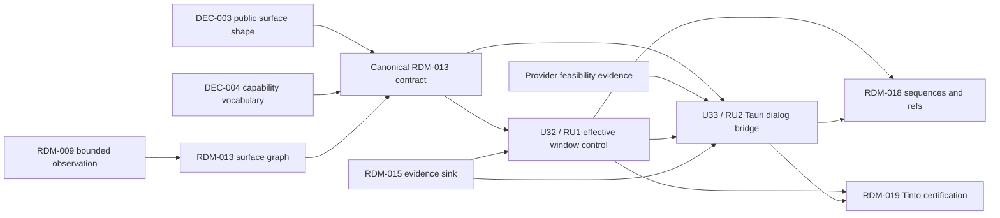

# RDM-014 truthful native control and Tauri dialog dependency map

## Dependency Graph

The graph consumes the canonical RDM-013 contract. DEC-003 and DEC-004 are applied parent decisions, not local design options: public projection uses additive dedicated operations and the explicit bounded state matrix. Provider feasibility remains an implementation verification input for the supported dialog action; a failed check records unsupported truth rather than blocking the product package.

## Dependency Waves

| Wave | Units | Entry criteria | Exit evidence | State |
| --- | --- | --- | --- | --- |
| 0 | Parent contract and feasibility | RDM-013 accepted contract, applied DEC-003 and DEC-004, provider boundary inspection | Canonical decisions are readable; provider support matrix is recorded as an implementation verification input | ready; provider check required for supported action |
| 1 | U32 / RU1 | Wave 0; existing WebDriver/session seams; RDM-015 sink optional for internal producer records | Effective probe, bounded dimensions, canonical public mapping, typed outcomes, postcondition tests | ready |
| 2 | U33 / RU2 | Wave 0; provider feasibility verification; U32 authenticated provider/session seam | Dialog metadata, grant validation, one-shot accept/cancel, postcondition, redaction and replay tests | serial after RU1; unsupported result is valid if provider check fails |
| 3 | Parent reconciliation | RU1/RU2 evidence, RDM-015 sink, RDM-018 generation composition | Aggregate checks and RDM-019 handoff inputs reconciled by Seneschal | not in child |

## Plan Unit and Review-Unit Mapping

| Plan unit | Review unit | Depends on | Blocks | Reason for boundary |
| --- | --- | --- | --- | --- |
| U32 effective capability probes, initial/effective sizing, window postconditions | RU1 | RDM-013 contract and applied public mapping; existing provider/session ownership | U33 shared provider seam; RDM-018/RDM-019 | Window behavior has a coherent provider and compatibility risk that can be verified without native-dialog authority. |
| U33 dialog detection, provider bridge, grant and sanitized decision evidence | RU2 | RDM-013 contract, provider feasibility, U32 authenticated seam, RDM-015 sink for final projection | RDM-018/RDM-019 | Native authorization and provider boundary are a distinct security slice; separating it keeps grant/replay review focused. |

RU1 and RU2 form a shallow two-unit stack. RU2 must not open until RU1's shared provider/session seam is reviewed or the parent explicitly retargets it to the refreshed integration base. At the cap, wait for the parent merge or collapse onto the integration base; do not create a deeper chain or a docs-only consolidation branch.

## Shared Surface Ownership

| Surface | RDM-014 use | Owner or sibling relationship | Rule |
| --- | --- | --- | --- |
| `src/webdriver/client.ts`, `src/webdriver/protocol.ts` | Capability probe, window postcondition, dialog bridge adapter | RDM-013 owns surface discovery/context semantics; RDM-015 consumes provider evidence; RDM-018 consumes generation rules | Serialize provider-client edits. Keep private handles, ports, and nonces inside the authenticated client. |
| `src/session/manager.ts`, `src/session/state.ts` | Launch binding, active surface, generation, process identity | RDM-013 owns selected-surface state; RDM-016 owns process custody; RDM-018 owns sequence/generation composition | Consume ownership evidence. Do not redefine lease, cleanup, or generation contracts. |
| `src/mcp/domain-ports.ts`, `src/mcp/schemas.ts`, `src/mcp/server.ts`, `src/mcp/runtime.ts`, `src/mcp/tools/index.ts` | Public window/dialog projection | RDM-013 owns the applied DEC-003/004 contract; RDM-015 has a parallel public query lane; RDM-018 adds sequence/ref operations | Use additive dedicated operations and the canonical state matrix. Parent serializes all MCP schema/runtime changes. |
| `src/installer/capabilities.ts` and generated Tauri capability fixtures | Compose required window/dialog application permission | RDM-020 audits attribution; application maintainer owns unrelated capability entries | Preserve existing entries and markers; additive composition only; no shared fixture edits in parallel. |
| Provider/plugin boundary under `vendor/tauri-plugin-wdio-webdriver` or an equivalent adapter | Detect and decide supported Tauri dialogs | Provider feasibility decides whether this boundary can support RDM-014 | Do not equate existing JavaScript-alert plumbing with Tauri dialog support without fixture evidence. No arbitrary Tauri command. |
| `docs/contracts.md`, `docs/security.md`, `docs/compatibility.md` | Document proven additive behavior | Maintained docs land with the related executable review unit | No docs-only branch; do not document unsupported behavior as supported. |
| Focused tests and shared fixtures | Contract, integration, Windows/Linux provider proof | RDM-013/RDM-015/RDM-018 own overlapping fixtures | Seneschal serializes fixture changes and runs aggregate tests once per fingerprint. |

## Applied Decisions

### DEC-2026-08-21-003 / DEC-003 — applied

- **Decision:** Use additive dedicated discovery and selection operations; preserve existing calls.
- **Affected RDM-014 work:** public capability projection, active-surface targeting, dialog owning-surface correlation, and MCP adapter tests consume this shape.
- **Canonical source:** `docs/plans/tinto-e2e-reliability/initiative-requirements.md#approved-decisions-and-escalation-boundaries` (applied 2026-08-21T12:04:48Z).

### DEC-2026-08-21-004 / DEC-004 — applied

- **Decision:** Use `supported`, `unsupported`, `unavailable`, `denied`, and `failed` states with stable codes and bounded sanitized evidence.
- **Affected RDM-014 work:** public mapping for permission denial, incompatibility, unavailable/unsupported, unimplemented operation, failed postcondition, and dialog decision evidence uses this matrix.
- **Canonical source:** `docs/plans/tinto-e2e-reliability/initiative-requirements.md#approved-decisions-and-escalation-boundaries` (applied 2026-08-21T12:04:48Z).

## Provider Feasibility Verification

The implementation must establish all of the following on the selected provider before claiming a supported U33 decision action:

- Dialog presence is observable through the authenticated provider session without screen scraping or arbitrary operating-system inspection.
- Title, message, a finite button set, and owning-surface correlation can be bounded and sanitized at the provider boundary.
- Accept/cancel is a purpose-built provider operation with a verifiable postcondition and no generic command input.
- Provider state can be bound to the owned process, launch nonce, session, active surface, generation, and one dialog instance.
- Unsupported, unavailable, denied, and failed provider outcomes can be observed without leaking raw causes or private identifiers.

If any condition fails, U33 records the canonical detection-only unsupported result. The failure is recorded as provider feasibility evidence, is not treated as a product blocker, and does not authorize an alternative native automation mechanism.

## Downstream Consumption

| Consumer | Consumes | Required reconciliation |
| --- | --- | --- |
| RDM-015 | Bounded window/dialog producer records | Use the accepted sanitize-before-store sink and public query decisions; RDM-014 does not create a second diagnostic store. |
| RDM-018 | Window/dialog action effects and generation implications | Consume accepted stale/uncertain-generation rules; do not use dialog grant consumption to infer reference freshness. |
| RDM-019 | Tinto access-mode confirmation and rejected grant evidence | Prove successful authorized action, denied authorization, timeout/no-choice, and zero owned residue through the public MCP path. |
| RDM-023 | Cross-platform regression certification | Include the provider matrix and any named unsupported environments; no release claim from artifact-only planning. |
