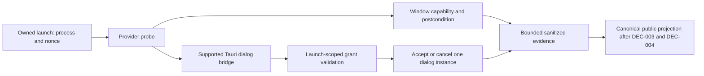
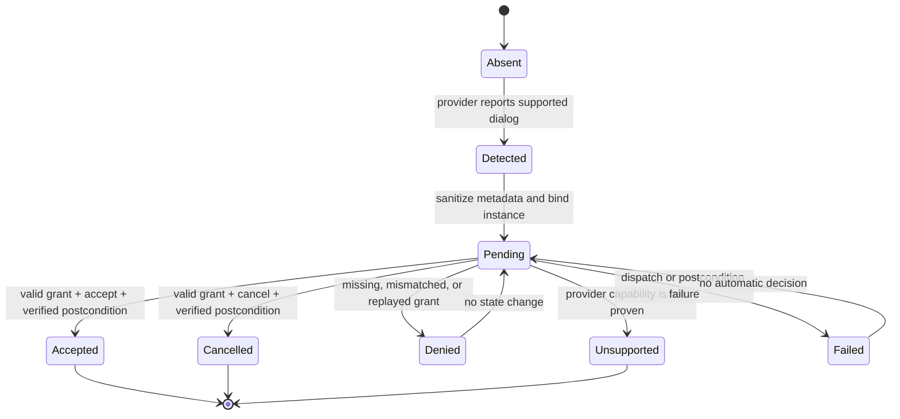

# RDM-014 truthful native control and Tauri dialog - Plan

## Goal Capsule

- **Objective:** Make window support truthful and make supported Tauri dialog decisions explicit, authorized, replay-resistant, postcondition-verified, and boundedly auditable within one owned session.
- **Means:** Build an internal effective-capability probe and a purpose-built provider dialog boundary, then project them through the canonical RDM-013 public contract (KTD1, KTD2).
- **Authority:** The inherited initiative and focused requirements own product behavior. The canonical DEC-003 and DEC-004 answers are applied here: additive dedicated discovery/selection operations and the explicit capability-state matrix with bounded sanitized evidence.
- **Execution profile:** Deep, high-risk, implementation-ready planning. RU1 and RU2 may proceed through the canonical public projection; provider feasibility remains an implementation verification requirement for supported dialog actions.
- **Stop conditions:** If a provider cannot prove the dialog boundary, implement the canonical unsupported result and keep decision actions disabled. Stop only for an unbound capability/grant, an invented public shape, arbitrary OS automation, or an unowned process.

## Product Contract

### Summary

The focused requirements define RDM-014 behavior for effective window support and capability-gated Tauri dialogs. The implementation plan preserves those requirements and divides the work into a window/control unit and a native-dialog/grant unit so each has independent verification and security ownership.

### Problem Frame

The current client attempts WebDriver window routes and a Tauri JavaScript fallback, then collapses provider failures into `UNSUPPORTED_ACTION`. It does not establish effective support before exposing the action. The repository has WebDriver alert plumbing for browser alerts, but that is not evidence that the Tauri dialog plugin/runtime can expose the required dialog metadata and decision postcondition. RDM-014 therefore needs provider-feasibility verification and a narrow bridge rather than a generic native automation path.

### Requirements

- R1-R5 govern effective capability probes, bounded initial/effective dimensions, postcondition verification, typed internal outcome evidence, and unsupported-provider truth.
- R6-R9 govern supported Tauri dialog detection, finite sanitized metadata, grant-required accept/cancel, one-shot dialog binding, and decision postconditions.
- R10-R12 govern one-session/process/nonce/generation ownership, sanitize-before-store evidence, and compatibility.
- The full requirement text and acceptance examples are owned by `docs/plans/tinto-e2e-reliability/2026-08-21-rdm-014-native-control-requirements.md`.

### Scope Boundaries

- **In scope:** the two implementation units below, their focused tests, provider feasibility fixtures, and maintained contract/security/compatibility documentation that describes proven behavior.
- **Deferred to follow-up:** bounded sequences and generation outcome composition belong to RDM-018; full Tinto and forced-failure certification belongs to RDM-019; the shared public evidence query belongs to RDM-015.
- **Outside the product identity:** arbitrary desktop automation, operating-system dialog enumeration, screen coordinates, OCR, shell/command passthrough, arbitrary JavaScript, and unscoped WebDriver routes.

### Resolved Contract Inputs and Verification Requirements

- **DEC-2026-08-21-003 (DEC-003), applied:** use additive dedicated discovery and selection operations; preserve existing snapshot and window calls.
- **DEC-2026-08-21-004 (DEC-004), applied:** use `supported`, `unsupported`, `unavailable`, `denied`, and `failed` states with stable codes and bounded sanitized evidence.
- **Provider feasibility verification:** the selected provider/plugin must prove native Tauri dialog presence, bounded metadata, and a decision postcondition through the authenticated bridge. If it cannot, implementation records unsupported detection and disables decision actions; provider capability is not inferred or substituted with fallback automation.

## Planning Contract

### Key Technical Decisions

- KTD1. **Probe before capability projection.** Resolve provider/plugin availability, integration permission, read-only route support, and current-session ownership before projecting window action availability. Dispatch can be attempted only after this probe, and success still requires an observed postcondition.
- KTD2. **Use a purpose-built dialog boundary.** Native dialog operations go through one authenticated provider adapter with finite detection and decision operations. WebDriver alert endpoints are not treated as Tauri-dialog support unless a provider fixture proves that they represent the same supported Tauri dialog source.
- KTD3. **Bind and consume grant authority at the dialog instance.** Keep the random launch-scoped grant private to the session. Validate its allowed action, launch/session/process/nonce binding, active surface, generation, and dialog instance before consuming it once.
- KTD4. **Sanitize at the producer boundary.** Clip and normalize dialog metadata and window outcomes before they enter session evidence or MCP serialization. Grant material, nonce, private provider identity, raw paths, raw causes, and raw application content never become evidence.
- KTD5. **Preserve a safe unsupported fallback.** Provider uncertainty, absent integration capability, unimplemented operations, and denied permissions remain non-actionable and produce bounded typed evidence. They never trigger OS input or a guessed WebDriver route.

### High-Level Technical Design

The implementation has four boundaries: launch/session ownership, provider capability probing, the dialog bridge, and the public MCP projection. RDM-013 owns the public surface composition and capability vocabulary. RDM-014 owns private typed outcomes, window postcondition checks, grant validation, and bounded producer evidence. RDM-015 consumes producer evidence through its accepted sink.

The dialog state machine rejects all transitions that lack the current launch binding or an allowed action. A timeout leaves the dialog pending and records no decision.

### Sequencing and Gates

1. **Wave 0 — inherited-contract validation:** validate the accepted RDM-013 surface contract and run the provider feasibility verification. The canonical public shape and vocabulary are already applied; unsupported provider evidence must be explicit and bounded.
2. **Wave 1 — RU1/U32:** implement the internal window capability probe, initial-size validation, provider dispatch classification, effective rect/state verification, additive dedicated public wiring, and focused unit/provider tests.
3. **Wave 2 — RU2/U33:** implement the provider-native dialog adapter, bounded detection, grant validation and consumption, decision postcondition, sanitized evidence, and provider fixture tests. Reuse U32's authenticated provider/session seam without reopening its window contract.
4. **Wave 3 — parent reconciliation:** serialize changes to `src/mcp`, `src/session`, `src/webdriver/client.ts`, capability generation, and shared fixtures with RDM-013, RDM-015, and RDM-018. The parent runs aggregate verification and reconciles the package after focused gates pass.

## Implementation Units

### U32. Effective window capabilities and verified sizing

- **Goal:** Advertise and execute only window actions that the active provider can perform and verify, including an additive bounded initial size when the canonical input contract permits it.
- **Requirements:** R1-R5, R10, and R12.
- **Files:** `src/webdriver/client.ts`, `src/webdriver/protocol.ts`, `src/webdriver/errors.ts`, `src/interaction/engine.ts`, `src/session/manager.ts`, `src/session/state.ts`, `src/mcp/runtime.ts`, `src/mcp/schemas.ts`, `src/mcp/domain-ports.ts`, `src/mcp/server.ts`, `src/mcp/tools/index.ts`, `src/config/schema.ts`, `src/config/generate.ts`, `src/installer/capabilities.ts`, `tests/unit/interaction.test.ts`, `tests/unit/webdriver-client.test.ts`, `tests/unit/mcp-runtime.test.ts`, `tests/contract/mcp-server.test.ts`, `tests/contract/real-usage-journey.test.ts`, `tests/platform/public-journey.test.ts`, and `tests/platform/provider-proof.test.ts` as applicable.
- **Approach:** Keep the provider route and Tauri fallback behind a private capability adapter. Probe integration permission and read-only provider support at launch. Classify permission denial, incompatibility, unimplemented operation, and failed postcondition before public mapping. Reuse existing dimension bounds and exact session/generation checks. Treat a dispatch result as provisional until the effective rect/state is observed.
- **Test scenarios:**
  - **Happy path:** provider supports the operation and permission; launch records effective dimensions; resize, maximize, and restore return verified state.
  - **Edge cases:** absent initial dimensions preserve current behavior; already-maximized and already-restored requests remain deterministic; provider reports equivalent physical/logical dimensions within the accepted comparison rule.
  - **Error paths:** missing permission, incompatible provider/plugin, unknown route, timeout, and mismatched rect produce distinct private outcomes and bounded public evidence; no action is advertised as proven.
  - **Integration:** Windows and Linux provider fixtures exercise launch probe, fallback selection, postcondition timeout, session ownership, and no-surface compatibility.
- **Verification:** `pnpm test:unit`, `pnpm test:contract`, `pnpm test:integration`, and `pnpm test:platform:windows` against the applied public contract; Linux structural/provider evidence is recorded when available. Provider feasibility is a required implementation verification result.

### U33. Tauri dialog bridge, grant, and decision evidence

- **Goal:** Detect supported Tauri dialogs and permit only an authorized, one-shot accept or cancel bound to the current owned session and dialog instance.
- **Requirements:** R6-R12.
- **Files:** `src/webdriver/client.ts` or a provider-private adapter module, `src/webdriver/protocol.ts`, `src/interaction/engine.ts`, `src/session/manager.ts`, `src/session/state.ts`, `src/mcp/runtime.ts`, `src/mcp/domain-ports.ts`, `src/mcp/schemas.ts`, `src/mcp/server.ts`, `src/mcp/tools/index.ts`, `src/installer/capabilities.ts`, the narrowly scoped provider/plugin bridge required by the feasibility result, `tests/unit/webdriver-client.test.ts`, `tests/unit/interaction.test.ts`, `tests/unit/mcp-runtime.test.ts`, `tests/contract/mcp-server.test.ts`, `tests/contract/real-usage-journey.test.ts`, `tests/integration/`, `tests/platform/provider-proof.test.ts`, and maintained `docs/contracts.md`, `docs/security.md`, and `docs/compatibility.md` text where behavior is proven.
- **Approach:** Probe the provider for a supported Tauri dialog boundary before exposing detection or decision actions. Normalize only title, message, finite buttons, owning-surface correlation, and a private dialog-instance identity. Validate the launch-scoped grant against the owning session, process identity, nonce, active surface, generation, allowed action, and dialog instance. Consume it once, perform the decision, verify the dialog is resolved, and send only bounded sanitized evidence to the accepted RDM-015 sink. Do not rely on the existing JavaScript-alert state unless a fixture proves equivalence to a Tauri dialog.
- **Test scenarios:**
  - **Happy path:** supported fixture reports a dialog; a grant naming accept resolves it; a separate grant naming cancel resolves the cancel case; evidence contains the bounded decision and postcondition.
  - **Edge cases:** finite button list, empty or long text, repeated detection of the same instance, a new instance after resolution, surface switch, generation refresh, and provider absence remain bounded and deterministic.
  - **Error paths:** missing or malformed grant, wrong allowed action, replay, wrong session/process/nonce/surface/generation, expired launch, unsupported provider, no dialog, provider timeout, and failed postcondition all fail closed without choosing a button.
  - **Integration:** Windows and Linux fixtures (where supported) prove the complete detect-authorize-decide-evidence flow and a rejected authorization case through the public boundary.
- **Verification:** `pnpm test:unit`, `pnpm test:contract`, `pnpm test:integration`, and `pnpm test:platform:windows`; provider capability and Linux evidence gaps are recorded rather than treated as support. A provider gap yields the canonical unsupported state, not a product blocker.

## Verification Contract

| Gate | Command or evidence | Applies to | Completion signal |
| --- | --- | --- | --- |
| Unit behavior | `pnpm test:unit` | U32/U33 internals and grant state | Probes, postcondition classification, bounds, binding, replay, and sanitization pass. |
| MCP contract | `pnpm test:contract` | Public projection using applied DEC-003/004 | Existing tools remain compatible; new outcomes and dialog operations are strict, bounded, and canonical. |
| Runtime integration | `pnpm test:integration` | Launch/session/provider bridge | One session, active surface, nonce, process binding, capability composition, dialog fixture, and cleanup remain valid. |
| Windows provider | `pnpm test:platform:windows` | Supported Windows runtime | Effective dimensions and dialog decision evidence are proven on the real provider or recorded as unsupported with a concrete gap. |
| Linux provider | `pnpm test:platform:linux` when host permits | Supported Linux runtime | Same truthfulness and security matrix; unavailable host capability is a named CI-only gap. |
| Aggregate prevention | Root-owned `pnpm build`, `pnpm typecheck`, `pnpm lint`, `pnpm format:check`, `pnpm test`, `pnpm pack:check` | Parent reconciliation | Aggregate fingerprint is green after serialized public/provider changes. |
| Package gate | `python <compound-master-skill-dir>/scripts/check_work_package.py docs/work-packages/RDM-014-native-control/2026-08-21-014-native-control-work-package.md` | Artifact only | Work-package review-unit contract passes; no product tests run in this child. |

No product command is run in the current artifact-only phase. Future test evidence must include redaction assertions that prove no grant, nonce, raw provider identity, raw path, or unbounded application text escapes the trust boundary.

## Definition of Done

- The canonical RDM-013 decisions DEC-003 and DEC-004 are recorded in the initiative contract and consumed without a competing RDM-014 public shape.
- Provider feasibility is verified during implementation: it proves the supported Tauri dialog boundary, or the implementation records the provider as unsupported and disables decision actions without fallback automation.
- U32 proves effective window capability and postcondition behavior for supported and unsupported providers, including initial dimensions and no-surface compatibility.
- U33 proves bounded dialog metadata, grant validation, one-shot decision binding, postcondition verification, rejected authorization, replay resistance, and sanitized default evidence.
- All changed public/provider/session/capability surfaces have an Impact Scan, focused tests, security review, and aggregate break-prevention evidence.
- No product code, product tests, configuration, generated output, Jira, branch, PR, release, or sibling artifact is changed during the current artifact run.
- Abandoned implementation attempts are removed before a future execution unit is declared complete; no exploratory bridge or generic native-input path remains in the diff.

## Risks and Dependencies

- **RDM-013 public-contract drift:** changing operation shape or vocabulary locally would break compatibility and sibling composition. Use the applied canonical answers and do not create a competing public contract.
- **False provider support:** WebDriver alert endpoints may represent JavaScript alerts rather than Tauri dialogs. Require a fixture that proves source, metadata, and postcondition equivalence.
- **Grant replay or confused deputy:** bind to process identity, launch nonce, session, surface, generation, action, and dialog instance; consume once and keep the grant private.
- **Native disclosure:** sanitize before memory/evidence and cap metadata fields and finite buttons according to the accepted bounded-output policy.
- **Shared seam collision:** RDM-013/RDM-015/RDM-018 share `src/mcp`, `src/session`, provider interfaces, and fixtures. Seneschal serializes those edits and reconciles the integration base before the next unit.
