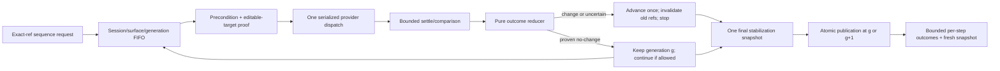

# RDM-018 bounded sequences and deterministic reference generations plan

## Outcome

Make interaction batching safe without weakening exact-reference authority.
RDM-018 first replaces the current unconditional reference clearing and
inconsistent numeric advancement with one pure outcome reducer. It then adds a
strict additive sequence boundary that executes exact-ref actions serially,
stops at the first generation-changing or uncertain result, and returns one
bounded final stabilization snapshot. Focused typing remains exact-ref based
and proves editability before clear/type.

The plan consumes three upstream contracts and intentionally does not invent a
surface, native-dialog, or continuation contract:

- RDM-009: continuation evidence is non-actionable; action requires a separate
  fresh actionable snapshot and current-generation opaque ref.
- RDM-013: surface discovery/selection is additive, capabilities use
  `supported`, `unsupported`, `unavailable`, `denied`, and `failed`, and surface
  changes publish fresh generation evidence.
- RDM-014: effective window/native-dialog results are capability-gated and
  bounded; sequences never authorize a native dialog or replace explicit
  dialog operations.

Implementation must wait for Seneschal to reconcile those artifacts and their
shared revision. The document packet is complete; this plan is not a license
to mutate product files in the current artifact mode.

## Constraints and planning assumptions

- Preserve one local `stdio` MCP session, one owned application session,
  exact W3C handles, active-surface ownership, bounded MCP output, mandatory
  redaction, and existing cleanup/process-custody boundaries.
- Preserve existing individual interaction and observation behavior unless the
  matrix explicitly changes stale/uncertain generation publication.
- Treat a successful observation as an RDM-009 observation boundary. A
  comparison-only stabilization can prove no-change without replacing the
  actionable table; an advancing action reserves exactly one generation and
  publishes at most one replacement table.
- Numeric bounds are item-local conservative defaults: `maxSteps` default 8,
  maximum 32; `timeoutMs` default 10,000, maximum 30,000. They must remain
  strict, finite, and transport-safe; changing them is a public-contract
  decision, not an implementation convenience.
- `tauri_sequence` is the additive contract name used for planning. Wire
  fields must be reconciled with the accepted RDM-013/014 schemas before code;
  no existing tool is renamed or widened incompatibly.
- The sequence action set is limited to existing semantic actions (`click`,
  `type`, `pressKey`, `pointer`, `scroll`, `selectOption`) and bounded `wait`.
  Window and native-dialog decisions remain explicit operations.

## High-level technical design

The reducer receives facts, not inferred booleans: dispatch phase, provider
effect proof, target identity/surface proof, comparable before/after state,
cancellation/deadline phase, and final-refresh status. It returns one of
`proven_no_change`, `proven_state_change`, or `uncertain`, plus a stable reason
and the exact publication operation. A reducer test table is the authority;
standalone actions and sequences must use the same reducer.

### Exact generation algorithm

For current generation `g`:

1. Validate the request and exact target against the owned table. A malformed,
   unknown, continuation, wrong-session, or stable-identity-only target never
   dispatches. If identity/surface is proven unchanged, preserve `g`; if a
   detached or changed identity proves state/surface drift, reserve `g+1`,
   invalidate refs, and stop.
2. Dispatch one provider action only after validation. A provider rejection
   with explicit no-effect proof is `proven_no_change`; a timeout, transport
   loss, cancellation after dispatch, or missing postcondition is `uncertain`.
3. Settle within the step budget, then perform a bounded comparison. A
   proven unchanged window/surface/semantic/focus state preserves `g`; any
   proven state/surface/focus change advances exactly once.
4. On an advancing result, invalidate the old table before any result leaves
   the trust boundary. The final fresh snapshot populates the reserved
   generation atomically; it must not increment a second time.
5. On uncertainty, advance exactly once with a stable bounded reason and no
   old refs. If final stabilization succeeds, publish fresh refs at the
   reserved generation; otherwise return no actionable snapshot.
6. On a final-refresh failure after any attempted step, never return an old
   snapshot as actionable. Preserve generation only when all work was proven
   no-change and the final comparison itself proves no-change.

This algorithm explicitly removes the current pattern where `mutate()` or
`observe()` clears the table regardless of whether the provider proved no
dispatch, and where `ReferenceTable.replace()` can add an extra numeric step
after an uncertainty advance.

## Plan units

| Unit | Scope and deliverable | Dependencies | Primary surfaces | Focused proof |
| --- | --- | --- | --- | --- |
| U37 | Pure generation outcome reducer, atomic reserve/publish API, action/observation integration, and focused editable-target semantics. | RDM-009 generation/continuation contract; RDM-013 surface identity; RDM-014 effective-control outcomes. | `src/observation/refs.ts`, `src/observation/snapshot.ts`, `src/interaction/engine.ts`, new `src/interaction/generation.ts`, `src/shared/errors.ts`, unit tests, maintained contract/security text only where proven. | Exhaustive reducer matrix; exactly-once numeric advancement; no-change preservation; stale/wrong-surface invalidation; uncertain reason; cancellation phase; concurrent FIFO. |
| U38 | Bounded sequence executor, strict additive MCP/domain projection, final stabilization, per-step outcomes, early stop, and sequence security/compatibility fixtures. | U37; accepted RDM-013 public surface/capability shape; RDM-014 effective provider/dialog boundary; serialized shared MCP/session seam. | New `src/interaction/sequence.ts` or equivalent; `src/mcp/schemas.ts`, `src/mcp/domain-ports.ts`, `src/mcp/runtime.ts`, `src/mcp/server.ts`, `src/mcp/tools/index.ts`, `tests/unit/`, `tests/contract/`, `tests/integration/`, platform fixtures, `docs/contracts.md`, `docs/architecture.md`, `docs/security.md`, `docs/compatibility.md` where behavior is proven. | Count/deadline/early-stop, exact refs, final single snapshot, editable typing, cancellation/timeout, framing/redaction, capability states, existing-tool compatibility, Windows/Linux provider evidence. |

## Dependency and execution waves

1. **Wave 0 — reconciliation gate:** Seneschal verifies the accepted RDM-009
   continuation/actionable-generation artifact, RDM-013 surface graph and
   capability matrix, and RDM-014 effective-control/dialog contract on one
   shared revision. Read-only source inspection may continue; no product
   implementation begins while any upstream artifact or shared revision is
   stale or unresolved.
2. **Wave 1 — RU1 / U37:** implement the pure matrix/reducer and atomic
   generation publication, then adapt individual actions and focused typing to
   it. This is one reviewable slice because a sequence cannot be safe while
   standalone action semantics still clear or increment inconsistently.
3. **Wave 2 — RU2 / U38:** implement the bounded FIFO sequence executor and
   additive public projection on the accepted U37 contract. Stop at the first
   generation-changing/uncertain step and emit exactly one final stabilization
   snapshot. Keep public schema, runtime, session, and fixtures serialized with
   RDM-013/014 and any active sibling touching those files.
4. **Wave 3 — Seneschal aggregate:** reconcile the sequence contract with
   RDM-019's Tinto journey, RDM-015 bounded diagnostics, and the root aggregate
   fingerprint. RDM-019 owns end-to-end certification; RDM-018 owns only the
   reusable bounded sequence behavior and its focused evidence.

No independent parallel mutation is safe for U37/U38: both touch central
session/generation and public MCP seams. Use two serial review units, target
one open PR and hard cap two; at the cap wait for the parent merge into `main`
or collapse the child onto the refreshed integration base.

## Detailed design

### U37 — deterministic generation reducer and exact actions

- Add a pure internal outcome type that distinguishes pre-dispatch rejection,
  no-effect proof, proven state/surface/focus change, and uncertainty. Keep
  stable reason codes bounded and independent of raw provider errors.
- Extend the reference table with an atomic reserve/publish path so a known
  change or uncertainty advances exactly once, invalidates old refs, and lets a
  successful final snapshot publish at the reserved generation without a
  second increment. Preserve current refs for proven no-change facts.
- Separate comparison-only stabilization from actionable snapshot publication.
  Comparison must use bounded window, active-surface, semantic, and focus
  signatures and must not turn a continuation page into an actionable ref.
- Integrate the reducer into click/type/key/pointer/scroll/select/window
  action paths as applicable. Do not let `mutate()` clear refs before knowing
  whether a dispatch occurred; map provider pre-dispatch no-effect evidence to
  `proven_no_change` and transport/timeout uncertainty to `uncertain`.
- Keep exact identity, attachment, enabled/visible, kind, and ownership checks.
  A detached/changed identity that proves state/surface drift advances and
  invalidates; an unchanged non-editable target rejects without dispatch and
  preserves the table.
- Focused typing validates editability immediately before clear/type. If
  clear starts and typing fails, classify according to provider evidence rather
  than unconditional clear; a possible partial write is uncertain.
- Keep existing action result fields compatible and add bounded effect/reason
  evidence only where the accepted public envelope permits it. Do not expose
  private handles, input text, raw causes, or provider identity.

Expected unit scenarios:

- every matrix row, including no-op success, pre-dispatch rejection,
  stale/changed identity, wrong surface/session, provider no-effect failure,
  dispatch timeout, cancellation before/after dispatch, and failed final
  refresh;
- one proven state change advances from `g` to `g+1`, never `g+2`; an
  uncertain action advances once and a successful final snapshot publishes at
  that generation;
- no-change preserves all current refs; a changed identity invalidates all
  refs; stale refs cannot be used by a concurrent queued action;
- current exact editable input succeeds; read-only, hidden, disabled,
  non-control, continuation, and wrong-generation refs dispatch nothing; and
- comparison-only stabilization cannot authorize an action or replace the
  current table without a proven change.

### U38 — bounded sequence executor and public boundary

- Validate the full request before dispatch: exact starting generation,
  finite step count, finite `maxSteps`/`timeoutMs`, strict step unions, bounded
  wait/settle values, and no unknown fields. Reject over-budget or malformed
  input without changing generation.
- Execute through the same FIFO as standalone interactions. Before every step,
  verify active session, active surface, and expected generation. A step may
  use only an exact current-generation ref. No step may rebind by stable ID,
  label, text, selector, geometry, or continuation metadata.
- Apply the U37 reducer after each step. A proven no-change step may continue
  when its target remains bound to `g`; a rejection is recorded and stops by
  default; any change, surface transition, stale identity, uncertainty,
  timeout, or cancellation stops immediately. Remaining steps are bounded
  `not_run` records in input order.
- Enforce wall-clock deadline across validation, dispatch, settle, comparison,
  and final stabilization. Use an injected monotonic clock for deterministic
  tests. No unbounded wait or retry is permitted. Caller cancellation follows
  the runtime/process-custody contract; a provider cancellation after dispatch
  is uncertain and cannot return old refs.
- Run at most one final stabilization snapshot after the last attempted step,
  including early stop. Return no intermediate snapshot payloads. Publish a
  fresh actionable snapshot only at the reducer's current generation; a
  continuation or failed refresh is bounded non-actionable evidence.
- Return a bounded result containing `startedGeneration`,
  `endingGeneration`, ordered step outcomes, `stoppedEarly`, `stopReason`, and
  optional `snapshotAfter`. Do not echo `type.text`, opaque refs beyond the
  required target correlation, private handles, raw errors/causes, paths,
  nonces, or provider payloads. Keep MCP output framing separate from internal
  step/result limits.
- Project truthful capability outcomes from RDM-013/RDM-014. If sequence
  support or a target operation is unsupported, unavailable, denied, or
  failed, return the canonical bounded state and do not emulate it with an
  alternate provider or native input.
- Add compatibility fixtures proving existing tools and no-sequence callers
  retain their current schemas/results. Add maintained docs only after the
  implementation proves the fields and platform behavior.

Expected contract/integration/platform scenarios:

- valid sequence of exact refs and waits executes FIFO; no-change steps may
  continue; one state-changing click/type/key stops the sequence and marks all
  later steps `not_run`;
- over-count, wall deadline, settle deadline, malformed action, unknown field,
  empty ref, continuation payload, wrong session/surface/generation, and
  unsupported capability fail closed without dispatch;
- final stabilization appears once, is fresh/actionable only when valid, and
  has the exact reducer generation; final refresh failure after uncertainty
  returns no old refs;
- concurrent sequence/action calls serialize and cannot reuse a ref after a
  parent step advances; client cancellation and transport loss produce bounded
  evidence and invoke existing owned cleanup only;
- text/secret/path/provider payload redaction, hostile application text, and
  MCP serialization limits hold for every step/result; and
- Windows and Linux provider fixtures record supported/unsupported gaps
  explicitly without claiming unproven sequence support.

## Verification contract

| Gate | Command/evidence | Applies to | Completion signal |
| --- | --- | --- | --- |
| Reducer and action unit | Focused generation/reference/interaction/sequence unit files; `pnpm test:unit` | U37 | Exhaustive matrix, exactly-once publication, exact refs, editable typing, and cancellation-phase tests pass. |
| MCP contract | Focused `tests/contract/mcp-server.test.ts`; `pnpm test:contract` | U38 | Additive strict schema, finite bounds, canonical capabilities, bounded outcomes, existing tools unchanged. |
| Runtime integration | Focused sequence/session/provider integration; `pnpm test:integration` | U37/U38 | FIFO, one owned session/surface, early stop, final snapshot, cleanup/cancellation, and no stale refs. |
| Platform/provider | `pnpm test:platform:windows`; `pnpm test:platform:linux` when host permits | U38 | Provider support is proven or recorded as explicit unsupported/unavailable evidence; no fallback automation. |
| Security/disclosure | Seeded sensitive-text/hostile-output and wrong-session/surface corpus | U37/U38 | No text, handle, nonce, cause, path, selector, or provider secret crosses the boundary. |
| Aggregate prevention | Root-owned `pnpm build`, `pnpm typecheck`, `pnpm lint`, `pnpm format:check`, `pnpm test`, `pnpm pack:check` | Seneschal reconciliation | Aggregate fingerprint is green after serialized public/session/provider changes. |

No product command runs during this artifact-only child. Verification in the
future execution lane must record exact host/provider skips and not convert
them to support claims.

## Risks and dependencies

- **RDM-009 contract drift:** changing continuation or actionable snapshot
  semantics locally would make old pages actionable. Consume its canonical
  fresh-snapshot rule and stop implementation until shared artifacts reconcile.
- **RDM-013 surface drift:** sequence targets must include the accepted active
  surface/session binding and canonical capability matrix. No local surface
  identity or capability synonym is allowed.
- **RDM-014 native boundary:** dialog authorization and window actions remain
  explicit and capability-gated. Sequence convenience must not become a
  confused-deputy path.
- **Numeric generation drift:** reserve/publish must be one atomic contract;
  tests must cover `g -> g+1` exactly once for change and uncertainty and
  `g -> g` for proven no-change.
- **Stale-reference reuse:** early stop and per-step generation checks prevent
  a later step from acting on a prior snapshot. No implicit lookup or retry.
- **Timeout ambiguity:** provider timeout/transport loss is uncertainty unless
  the provider supplies a bounded no-effect proof. Existing process custody
  owns cleanup; RDM-018 reports the sequence outcome only.
- **Disclosure:** per-step result bounds and sanitize-before-MCP framing must
  omit typed text and private provider fields, including hostile application
  payloads.
- **Shared seam collision:** `src/mcp`, `src/session`, `src/observation`,
  provider interfaces, and fixtures are serialized with RDM-013/014 and active
  siblings; Seneschal owns reconciliation and aggregate verification.

## Definition of done

- U37 and U38 map cleanly to RU1/RU2, have literal focused tests, and pass the
  work-package and document-review gates.
- The pure reducer is the sole authority for generation publication; no
  unconditional clear, inconsistent increment, or double increment remains.
- Exact-ref actions, continuation rejection, count/wall budgets, serial FIFO,
  early stop, per-step bounded outcomes, one final stabilization snapshot,
  focused typing, cancellation, timeout, security, and capability truth are
  all covered by the verification contract.
- Existing individual tools remain compatible and no sequence can authorize a
  native dialog or bypass one-session/active-surface/process ownership.
- The package is implementation-ready only after Seneschal reconciles RDM-009,
  RDM-013, and RDM-014 on the shared approved revision; no product
  implementation occurs before that gate.
