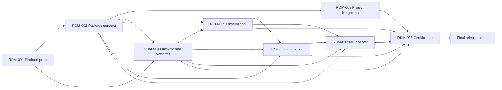

# pumarejo Implementation Roadmap

## Context Sufficiency Summary

- Product intent, users, outcomes, success criteria, scope, non-goals, certified platforms, and version policy are accepted in `STRATEGY.md` and `docs/product-requirements.md`.
- The package boundary, runtime modules, session lifecycle, consumer integration, public CLI/MCP contracts, test commands, CI targets, and final-only release policy are documented.
- The Windows and Ubuntu background mechanisms remain technically unproven, but the product decision is settled. The roadmap therefore makes their falsification proof the first hard gate instead of inventing a fallback scope.
- Repository base, remote, and registry credentials are needed only for final release. Their deferral does not alter implementation scope or dependency order.

## Source Inventory

| Source                                                           | Contribution                                                                                                                | Confidence |
| ---------------------------------------------------------------- | --------------------------------------------------------------------------------------------------------------------------- | ---------- |
| `STRATEGY.md`                                                    | Target user, problem, outcomes, success signals, product tracks, non-goals, and platform direction                          | High       |
| `docs/product-requirements.md`                                   | Validated functional and non-functional requirements, compatibility profile, flows, business rules, and acceptance criteria | High       |
| `docs/contracts.md`                                              | Versioned CLI, configuration, MCP tool, observation, interaction, and error contracts                                       | High       |
| `docs/architecture.md`                                           | Package architecture, state machine, module boundaries, integration mechanism, safety model, and feasibility gate           | High       |
| `docs/delivery-workflow.md`                                      | Serial delivery posture, quality gates, planned commands, CI matrix, and final-only release policy                          | High       |
| `docs/orchestration/2026-07-23-001-pumarejo-readiness-report.md` | Historical context gaps and the remediation basis for this roadmap                                                          | Medium     |

## Roadmap Items

- RDM-001. **Prove isolated visible and background control**

  - Outcome: Evidence demonstrates that a debug Tauri fixture can be observed and controlled through the embedded WebDriver path on Windows 11 and Ubuntu LTS without operating-system input, including a controlled window that does not occupy the developer's active desktop in background mode.
  - Why now: Background parity is a hard v1 requirement and the Windows mechanism is the highest-risk premise. Visible mode must also prove that semantic actions do not steal usable desktop control.
  - Scope boundary: Disposable fixture, embedded-provider integration, loopback/exclusive-session checks, visible/background process experiments, snapshot/screenshot/action sequence, and captured evidence. Excludes reusable package implementation beyond the smallest proof harness.
  - Environment prerequisite: Verified access to a native desktop-capable Windows 11 24H2 environment and an Ubuntu 24.04 LTS graphical environment. Before testing, record the OS build, session type, WebView runtime, display mechanism, and graphical prerequisites in `docs/evidence/rdm-001/`; WSL without an independently certified Ubuntu desktop session does not qualify.
  - Exit criteria: On each certified platform, visible and background modes complete launch, snapshot, screenshot, click, type, key press, and close; instrumentation records zero operating-system input; a separate foreground application remains usable; background mode never presents or transiently activates the controlled window on the active desktop; and non-loopback or non-exclusive WebDriver ownership is rejected.
  - Requirement traceability: FR-009, FR-010, FR-017, FR-019, FR-019a, FR-020, FR-021, FR-024, FR-025, FR-026, FR-027; NFR-001, NFR-002, NFR-004; BR-004, BR-005, BR-009; AC-003, AC-004, AC-005.
  - Hard depends on: None.
  - Soft sequencing preference: None.
  - Blocks/enables: RDM-002, RDM-004, RDM-008.
  - Risk: High; hidden rendering and WebDriver screenshot behavior are platform-specific and currently unproven.
  - Expected brainstorm: `docs/brainstorms/2026-07-23-pumarejo-platform-proof.md`
  - Expected plan: `docs/plans/2026-07-23-pumarejo-platform-proof.md`
  - Suggested work package: One feasibility package with explicit Windows and Ubuntu evidence checkpoints.

- RDM-002. **Establish the reusable package and public contract**

  - Outcome: A strict ESM TypeScript package exposes the documented CLI and MCP schemas, validates configuration v1, and has deterministic build, test, typecheck, lint, and pack commands.
  - Why now: Every feature depends on stable package entry points, types, error envelopes, and a testable module boundary.
  - Scope boundary: Repository scaffolding, package metadata, build/test tooling, config loader, shared schemas, error model, and public exports. Excludes project mutation and live application control.
  - Requirement traceability: FR-008; NFR-005, NFR-007; BR-001; AC-010.
  - Hard depends on: RDM-001.
  - Soft sequencing preference: None.
  - Blocks/enables: RDM-003, RDM-004, RDM-005, RDM-006, RDM-007.
  - Risk: Low; the contract and technology baseline are explicit.
  - Expected brainstorm: `docs/brainstorms/2026-07-23-pumarejo-package-contract.md`
  - Expected plan: `docs/plans/2026-07-23-pumarejo-package-contract.md`
  - Suggested work package: One package-foundation unit.

- RDM-003. **Instrument and diagnose consumer projects safely**

  - Outcome: `init`, `doctor`, and `remove` can prepare supported Tauri 2 projects idempotently, explain unsupported layouts, preview mutations, verify prerequisites, and reverse only attributable edits.
  - Why now: Live control is unusable as a reusable tool until consumer projects can be integrated in one guided, safe workflow.
  - Scope boundary: Tauri project detection, Cargo dependency edit, debug-only Rust registration, capability permission, config generation, integration manifest, dry-run, diagnostics, removal, and fixture coverage. Excludes MCP runtime behavior.
  - Requirement traceability: FR-001, FR-002, FR-003, FR-004, FR-005, FR-006, FR-007; NFR-003, NFR-008; BR-007; AC-001, AC-001a, AC-002, AC-008, AC-009.
  - Hard depends on: RDM-002.
  - Soft sequencing preference: None.
  - Blocks/enables: RDM-008.
  - Risk: Medium; Rust source layouts and existing project formatting can be ambiguous, so supported transformations must be deliberately bounded.
  - Expected brainstorm: `docs/brainstorms/2026-07-23-pumarejo-project-integration.md`
  - Expected plan: `docs/plans/2026-07-23-pumarejo-project-integration.md`
  - Suggested work package: Split by plan units for detection/configuration, mutation, diagnostics, and removal if review finds independent seams.

- RDM-004. **Own application, WebDriver, and platform lifecycles**

  - Outcome: One session manager launches the approved application command, owns its process tree and isolated endpoint, establishes the primary WebDriver window, supports visible/background adapters, and cleans every owned resource deterministically.
  - Why now: Observation and interaction need a reliable state machine and platform boundary before their semantics can be implemented safely.
  - Scope boundary: Session states, port selection, endpoint ownership, process supervision, readiness, WebDriver connection, window selection, platform adapters, cleanup, and lifecycle errors. Excludes semantic DOM extraction and component actions.
  - Requirement traceability: FR-009, FR-010, FR-011, FR-012, FR-013, FR-024, FR-025, FR-026, FR-027; NFR-002, NFR-004, NFR-006; BR-001, BR-003, BR-004, BR-005, BR-009; AC-003, AC-004, AC-007.
  - Hard depends on: RDM-001, RDM-002.
  - Soft sequencing preference: None.
  - Blocks/enables: RDM-005, RDM-006, RDM-007, RDM-008.
  - Risk: High; process-tree cleanup and background execution differ materially between Windows and Ubuntu.
  - Expected brainstorm: `docs/brainstorms/2026-07-23-pumarejo-session-platform.md`
  - Expected plan: `docs/plans/2026-07-23-pumarejo-session-platform.md`
  - Suggested work package: Split implementation units by shared lifecycle, Windows adapter, and Ubuntu adapter while retaining one reviewed roadmap item.

- RDM-005. **Expose faithful semantic observations**

  - Outcome: Snapshots communicate controls, meaningful content, relationships, focus, state, bounds, and redaction with generation-scoped references; screenshots provide complementary visual evidence under the artifact lifecycle policy.
  - Why now: Agent understanding of existing flows is the primary product outcome and provides the reference table used by interactions.
  - Scope boundary: DOM semantic extraction, compatibility-profile traversal, accessible metadata, content normalization, sensitive-value redaction, reference generations, screenshot capture, timestamps, artifact permissions, retention, untrusted-content isolation, and fixture rubrics. Application content remains only in typed data fields and is never interpolated into server instructions or recovery guidance. Excludes autonomous interpretation or exploration.
  - Requirement traceability: FR-014, FR-015, FR-016, FR-016a, FR-017, FR-018; NFR-009, NFR-010; BR-002, BR-006; AC-006, AC-006a, AC-006b, AC-011, AC-012, AC-013.
  - Hard depends on: RDM-002, RDM-004.
  - Soft sequencing preference: None.
  - Blocks/enables: RDM-006, RDM-007, RDM-008.
  - Risk: Medium; custom component semantics and open shadow-root traversal require representative fixtures to prevent false confidence.
  - Expected brainstorm: `docs/brainstorms/2026-07-23-pumarejo-observation.md`
  - Expected plan: `docs/plans/2026-07-23-pumarejo-observation.md`
  - Suggested work package: Split by semantic snapshot and screenshot/artifact units when the plan isolates their tests.

- RDM-006. **Provide semantic component interactions**

  - Outcome: Reference-based click and type plus active-element key presses operate entirely through WebDriver, preserve native DOM focus behavior, and return stable recovery guidance for stale or invalid targets.
  - Why now: The tool must let agents exercise flows after they understand the visible state, without ever taking the system pointer or keyboard.
  - Scope boundary: Click, clear/type, supported key mapping, active-element targeting, post-action generations, typed errors, and no-OS-input verification. Excludes gestures, drag-and-drop, file dialogs, native menus, and desktop automation.
  - Requirement traceability: FR-019, FR-019a, FR-020, FR-021, FR-022, FR-023; NFR-001, NFR-002; BR-002; AC-003, AC-004, AC-005, AC-006, AC-013.
  - Hard depends on: RDM-004, RDM-005.
  - Soft sequencing preference: None.
  - Blocks/enables: RDM-007, RDM-008.
  - Risk: Medium; stale references, custom focusable components, and platform focus behavior require cross-platform evidence.
  - Expected brainstorm: `docs/brainstorms/2026-07-23-pumarejo-interaction.md`
  - Expected plan: `docs/plans/2026-07-23-pumarejo-interaction.md`
  - Suggested work package: One interaction unit with shared reference/error tests.

- RDM-007. **Serve the complete MCP workflow**

  - Outcome: The stdio server exposes all seven v1 tools with validated schemas, protocol-clean output, state-aware dispatch, image content, structured errors, and an end-to-end MCP client flow.
  - Why now: The MCP adapter is the reusable agent-facing surface that composes the completed lifecycle, observation, and interaction capabilities.
  - Scope boundary: MCP server startup, tool registration, schema parsing, result serialization, stderr logging, image content blocks, cancellation/close handling, client guidance that marks rendered content non-authoritative, and protocol tests. UI-derived data remains in typed result fields and is never promoted into instructions or recovery guidance. Excludes alternative transports and agent reasoning.
  - Requirement traceability: FR-008, FR-009, FR-010, FR-011, FR-012, FR-013, FR-014, FR-015, FR-016, FR-016a, FR-017, FR-018, FR-019, FR-019a, FR-020, FR-021, FR-022, FR-023; NFR-004, NFR-005, NFR-010; BR-001, BR-007; AC-010.
  - Hard depends on: RDM-002, RDM-004, RDM-005, RDM-006.
  - Soft sequencing preference: RDM-003.
  - Blocks/enables: RDM-008.
  - Risk: Low; transport and schemas are explicit, with most complexity isolated behind internal adapters.
  - Expected brainstorm: `docs/brainstorms/2026-07-23-pumarejo-mcp-server.md`
  - Expected plan: `docs/plans/2026-07-23-pumarejo-mcp-server.md`
  - Suggested work package: One MCP composition unit.

- RDM-008. **Certify, harden, and prepare final release**
  - Outcome: The assembled package passes the full quality gate and published support matrix, proves debug-only release safety and no desktop input, demonstrates agent workflow understanding, and is ready for one final release handoff.
  - Why now: Cross-platform and product-outcome claims can only be accepted against the integrated system.
  - Scope boundary: Fixture matrix, mutation restoration, failure cleanup, security review, package audit, documentation, release-build inspection, agent-in-the-loop rubric, a prompt-injection fixture whose rendered UI attempts to issue agent instructions, and final artifact evidence. Release mutations themselves remain deferred to Release Marshal.
  - Requirement traceability: Every FR, NFR, BR, and AC in `docs/product-requirements.md`, with direct emphasis on NFR-003, NFR-007, NFR-010, BR-008, AC-001a, AC-005, AC-009, AC-011, AC-012, and AC-013.
  - Hard depends on: RDM-003, RDM-004, RDM-005, RDM-006, RDM-007.
  - Soft sequencing preference: None.
  - Blocks/enables: Final `krt-release-marshal` phase.
  - Risk: High; this is where platform parity, provider compatibility, and the core understanding outcome converge.
  - Expected brainstorm: `docs/brainstorms/2026-07-23-pumarejo-certification.md`
  - Expected plan: `docs/plans/2026-07-23-pumarejo-certification.md`
  - Suggested work package: Split by unit-test gate, Windows certification, Ubuntu certification, security review, and documentation evidence; release remains one final separate phase.

## Requirement Coverage

| Requirement group                                              | Roadmap coverage                                                       |
| -------------------------------------------------------------- | ---------------------------------------------------------------------- |
| FR-001 through FR-007                                          | RDM-003                                                                |
| FR-008                                                         | RDM-002, RDM-007                                                       |
| FR-009 through FR-013                                          | RDM-001, RDM-004, RDM-007                                              |
| FR-014 through FR-018, including FR-016a                       | RDM-005, RDM-007                                                       |
| FR-019 through FR-023, including FR-019a                       | RDM-001, RDM-006, RDM-007                                              |
| FR-024 through FR-027                                          | RDM-001, RDM-004                                                       |
| NFR-001 through NFR-010                                        | RDM-001 through RDM-008 as listed per item; all revalidated by RDM-008 |
| BR-001 through BR-009                                          | RDM-001 through RDM-008 as listed per item; all revalidated by RDM-008 |
| AC-001 through AC-013, including AC-001a, AC-006a, and AC-006b | Owning items as listed above; all executed and recorded by RDM-008     |

## Dependency Graph

## Parallelization Waves

- Wave 1: RDM-001 only; it is the feasibility gate.
- Wave 2: RDM-002.
- Wave 3: RDM-003 and RDM-004 may be planned independently after the package contract, though current delivery remains serial.
- Wave 4: RDM-005 after lifecycle readiness.
- Wave 5: RDM-006.
- Wave 6: RDM-007.
- Wave 7: RDM-008 integrated certification.
- Final phase: Release Marshal after every implementation and review gate passes.

## Branch and PR Strategy

| Work-package candidate                 | Base branch                                       | PR type                                                           | Dependency                 | Notes                                                                                                              |
| -------------------------------------- | ------------------------------------------------- | ----------------------------------------------------------------- | -------------------------- | ------------------------------------------------------------------------------------------------------------------ |
| RDM-001 through RDM-008 implementation | Current workspace until repository initialization | Local serial delivery                                             | Roadmap dependencies above | The user deferred release work; no branch, commit, push, or PR occurs during implementation.                       |
| Final release package                  | To be resolved by Release Marshal                 | Final release PR or direct release per resolved repository policy | RDM-008 accepted           | Base branch, remote, PR shape, registry credentials, and publication authority are explicit final-phase decisions. |

## Blockers and User Decisions

- Implementation blocker: RDM-001 must prove background behavior on both certified platforms and non-disruptive visible behavior before reusable implementation proceeds.
- Environment blocker: RDM-001 cannot pass until authoritative Windows 11 24H2 and Ubuntu 24.04 desktop-capable environments are available and their exact runtime details are recorded with the proof evidence.
- Final-release-only decisions: repository initialization/base branch, remote destination, PR granularity, package registry credentials, and publication authority.
- No additional product-scope decision is required before the first brainstorm and plan.
