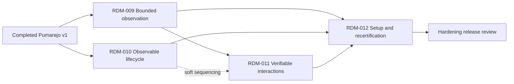

# Pumarejo Real-Usage Hardening Roadmap

## Context Sufficiency Summary

- The usage audit records concrete failures from a complete Windows Tauri journey and supplies ten testable acceptance criteria.
- Product boundaries remain settled: local MCP over `stdio`, one Pumarejo-owned session, exact generation-scoped references, no operating-system input, and debug-only consumer integration.
- The current implementation and v1 contracts expose the precise seams affected: observation, interaction, lifecycle, diagnostics, MCP serialization, and certification.
- Two public-contract decisions remain for the implementation plans: cursor semantics for generation-scoped snapshots and the MCP representation of a consultable long-running launch. They do not block roadmap generation, but must be resolved before their implementation units begin.

## Source Inventory

| Source                                              | Contribution                                                                                                              | Confidence |
| --------------------------------------------------- | ------------------------------------------------------------------------------------------------------------------------- | ---------- |
| `docs/audits/2026-07-28-pumarejo-usage-feedback.md` | Reproduced failures, preserved strengths, requested capabilities, and acceptance criteria                                 | High       |
| `STRATEGY.md`                                       | Target user, product tracks, success metrics, and non-goals that constrain the response                                   | High       |
| `docs/product-requirements.md`                      | Accepted lifecycle, observation, interaction, security, compatibility, and release requirements                           | High       |
| `docs/contracts.md`                                 | Current seven-tool MCP surface, strict schemas, generation rules, result shapes, and stable errors                        | High       |
| `docs/architecture.md`                              | Session state machine, package boundaries, ownership model, and replaceable WebDriver boundary                            | High       |
| `docs/delivery-workflow.md`                         | Quality gates, support matrix, release policy, and review expectations                                                    | Medium     |
| Current `src/` and `tests/`                         | Confirms hard snapshot limits, post-action refresh, ARIA extraction, lifecycle cancellation, and boolean-only diagnostics | High       |

## Roadmap Items

- RDM-009. **Bound and protect semantic observation**

  - Outcome: Large or sensitive views always return a valid bounded semantic result with explicit truncation, continuation guidance, and conservative disclosure defaults; applicable ARIA states and relationships remain faithful.
  - Why now: Real use produced an opaque `INTERNAL_ERROR` on a large Timeline view and exposed excessively long transcript-derived accessible names.
  - Scope boundary: subtree capture, node/depth/text limits, visibility and semantic filters, optional text/attribute omission, continuation metadata, configurable redaction that cannot weaken mandatory password/marked-sensitive protection, partial-evidence errors, and ARIA state/relationship regression coverage. Excludes OCR, closed shadow roots, arbitrary selectors, and application-specific content classification.
  - Hard depends on: Completed RDM-005 and RDM-007.
  - Soft sequencing preference: None.
  - Blocks/enables: RDM-011 and RDM-012.
  - Risk: High; pagination must preserve deterministic containment and exact generation-scoped refs without enabling stale or heuristic targeting.
  - Expected brainstorm: `docs/brainstorms/2026-07-28-bounded-semantic-observation.md`
  - Expected plan: `docs/plans/2026-07-28-bounded-semantic-observation.md`
  - Suggested package: Split into bounded snapshot protocol and redaction/ARIA fidelity review units.

- RDM-010. **Make long-running sessions observable and recoverable**

  - Outcome: Launch publishes stage progress, can be consulted after client timeout or cancellation, and converges through repeatable cleanup to either `idle` or a precise residue diagnosis.
  - Why now: The first native launch took almost two minutes, and cancellation was followed by repeated `CLOSE_FAILED` responses until transport shutdown.
  - Scope boundary: progress stages, recommended timeout metadata, consultable pending launch/session state, compact diagnostics, explicit closing and partial-cleanup states, idempotent close/retry, owned-process-tree fallback, and resource-level cleanup evidence. Excludes background services, remote transports, concurrent sessions, and termination of unowned processes.
  - Hard depends on: Completed RDM-004 and RDM-007.
  - Soft sequencing preference: None.
  - Blocks/enables: RDM-012.
  - Risk: High; cancellation crosses MCP, WebDriver, process, proxy, port, runtime-config, and artifact ownership boundaries.
  - Expected brainstorm: `docs/brainstorms/2026-07-28-observable-runtime-lifecycle.md`
  - Expected plan: `docs/plans/2026-07-28-observable-runtime-lifecycle.md`
  - Suggested package: Split progress/status from cancellation/cleanup recovery while reviewing the state machine as one roadmap item.

- RDM-011. **Verify desktop interactions and their effects**

  - Outcome: Actions report what was dispatched and what changed, return an optional bounded post-action snapshot or delta with fresh refs, and cover the small set of keyboard/window/pointer semantics required for desktop QA.
  - Why now: A click reported success after only moving focus, repeated `TAB` did not expose an explainable focus transition, and the current key-only surface cannot exercise common desktop flows.
  - Scope boundary: before/after focus, dispatch method, observable semantic/window effect classification, no-effect result, atomic action plus observation, modifier chords, resize/maximize/restore, region scroll, hover, double click, context menu, and explicit option selection. Excludes arbitrary WebDriver commands, drag-and-drop, native/OS dialogs, native menus, system input, and multiple-window certification.
  - Hard depends on: RDM-009.
  - Soft sequencing preference: RDM-010 so action diagnostics can reuse compact session-state vocabulary.
  - Blocks/enables: RDM-012.
  - Risk: High; “observable effect” must be narrowly defined so a successful dispatch is not confused with application-level business success.
  - Expected brainstorm: `docs/brainstorms/2026-07-28-verifiable-desktop-interactions.md`
  - Expected plan: `docs/plans/2026-07-28-verifiable-desktop-interactions.md`
  - Suggested package: Split verified/atomic action results from new keyboard and desktop operations.

- RDM-012. **Make setup actionable and recertify real usage**
  - Outcome: `doctor` explains the effective launch environment without false certainty, supported MCP hosts receive copyable local `stdio` configuration, version drift is detected, and the ten audit acceptance criteria pass through the public surface.
  - Why now: Real use required a custom SDK client because the MCP was not directly registered, while `doctor` incorrectly reported missing npm and WebView2 prerequisites that a successful launch later proved available.
  - Scope boundary: resolved executable and sanitized command reporting, explicit launch environment/runtime path, diagnostic confidence states, successful-launch evidence, JSON diagnostics, client configuration generation, CLI/manifest/plugin version checks, structured failure/partial-evidence coverage, documentation, and integrated acceptance evidence. Excludes OAuth, network endpoints, automatic host configuration mutation, registry publication, and broad platform expansion.
  - Hard depends on: RDM-009, RDM-010, and RDM-011.
  - Soft sequencing preference: None.
  - Blocks/enables: Release review for the hardening increment.
  - Risk: Medium; environment output must be actionable without exposing secrets or machine-specific sensitive values.
  - Expected brainstorm: `docs/brainstorms/2026-07-28-actionable-setup-and-certification.md`
  - Expected plan: `docs/plans/2026-07-28-actionable-setup-and-certification.md`
  - Suggested package: One diagnostics/onboarding review unit and one integrated real-usage certification unit.

## Acceptance Coverage

| Usage acceptance criterion                                           | Owning item |
| -------------------------------------------------------------------- | ----------- |
| 1. Large snapshot returns pagination/truncation and partial evidence | RDM-009     |
| 2. Sensitive text can be omitted or redacted before process exit     | RDM-009     |
| 3. Launch over 30 seconds publishes progress and remains consultable | RDM-010     |
| 4. Cancellation plus repeated close leaves zero owned processes      | RDM-010     |
| 5. `TAB` and a modifier chord report correct before/after focus      | RDM-011     |
| 6. Explicit 640×480, 800×600, and 1920×1032 sizes are confirmed      | RDM-011     |
| 7. Focus-only action reports no observable activation                | RDM-011     |
| 8. ARIA states and relationships are consistently preserved          | RDM-009     |
| 9. Successful launch corrects prerequisite false negatives           | RDM-012     |
| 10. Action plus fresh post-action snapshot is atomic                 | RDM-011     |

## Dependency Graph

## Parallelization Waves

- Wave 1: RDM-009 and RDM-010 are independently plannable; current repository policy still favors serial implementation and review.
- Wave 2: RDM-011 after the bounded post-action observation contract from RDM-009 is accepted.
- Wave 3: RDM-012 integrates setup, documentation, and the complete audit acceptance journey.

## Branch and PR Strategy

| Package candidate                      | Base branch                 | PR type               | Dependency              | Notes                                                                                              |
| -------------------------------------- | --------------------------- | --------------------- | ----------------------- | -------------------------------------------------------------------------------------------------- |
| RDM-009 through RDM-012 implementation | Current workspace           | Local serial delivery | Roadmap dependencies    | Current policy forbids intermediate branch, commit, push, PR, merge, Jira, and publication actions |
| Final hardening release handoff        | Resolved by Release Marshal | Final release PR/flow | RDM-009 through RDM-012 | Include all review, platform, security, compatibility, and sanitized usage evidence                |

## Blockers and User Decisions

- No blocker prevents delivery planning.
- Before RDM-009 implementation: decide cursor/subtree semantics across snapshot generations and whether continuation pages may carry actionable refs.
- Before RDM-010 implementation: choose the smallest MCP-compatible consultable-launch model while retaining local `stdio` and one owned session.
- Before RDM-011 implementation: define the finite list and exact contract names for new actions; arbitrary WebDriver passthrough remains out of scope.
- Before RDM-012 implementation: identify the initial host configuration formats to print; generation is allowed, automatic mutation is not.
